## On this Page

- [Creating Plug-In scaffold](#chapter-1)
- [Refactoring DSP and UI implementation](#chapter-2)
- [Adding VU meter backed by Metal](#chapter-3)

## Creating Plug-In scaffold <a name="chapter-1"></a>

AudioUnit v3 plug-ins needs to be implemented as **Application Extension**. Thus we need first to create host application.

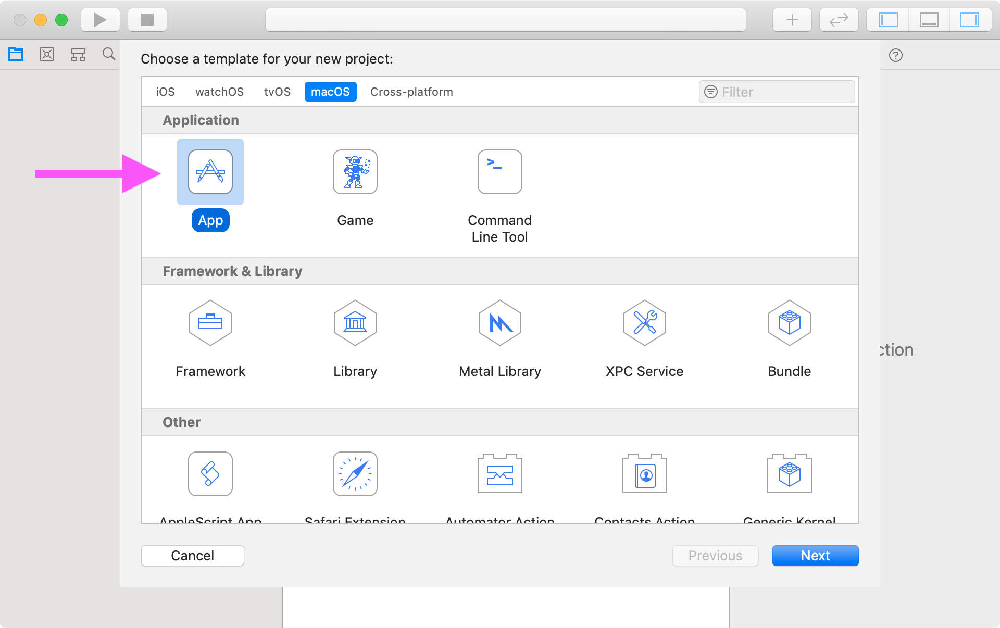

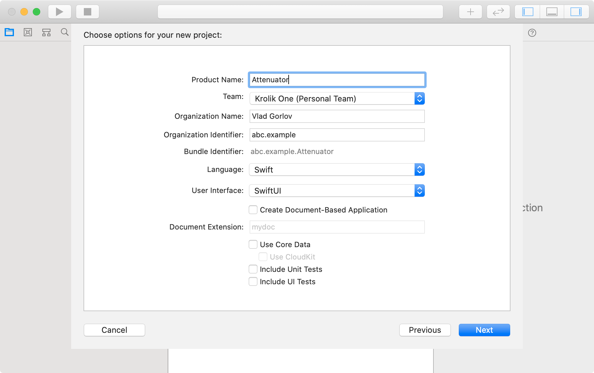

Now we can add AudioUnit extension into the host app.

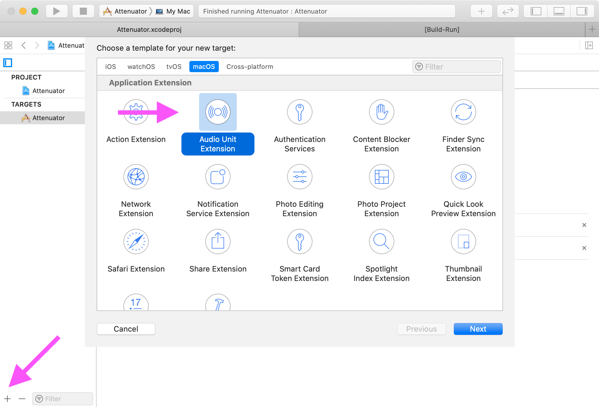

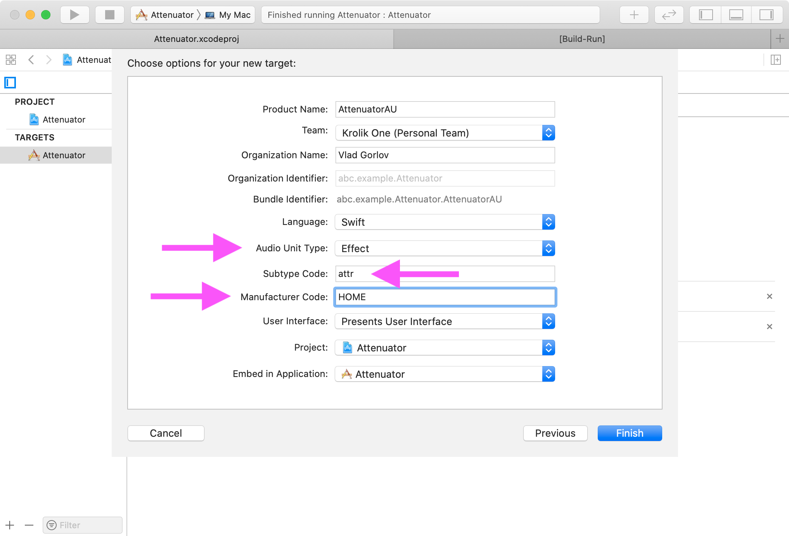

Now we can run and debug our plugin in some AUv3 host. For instance in Juce [AudioPluginHost.app](https://github.com/WeAreROLI/JUCE/tree/master/extras/AudioPluginHost/Builds/MacOSX) or in GarageBang.app.

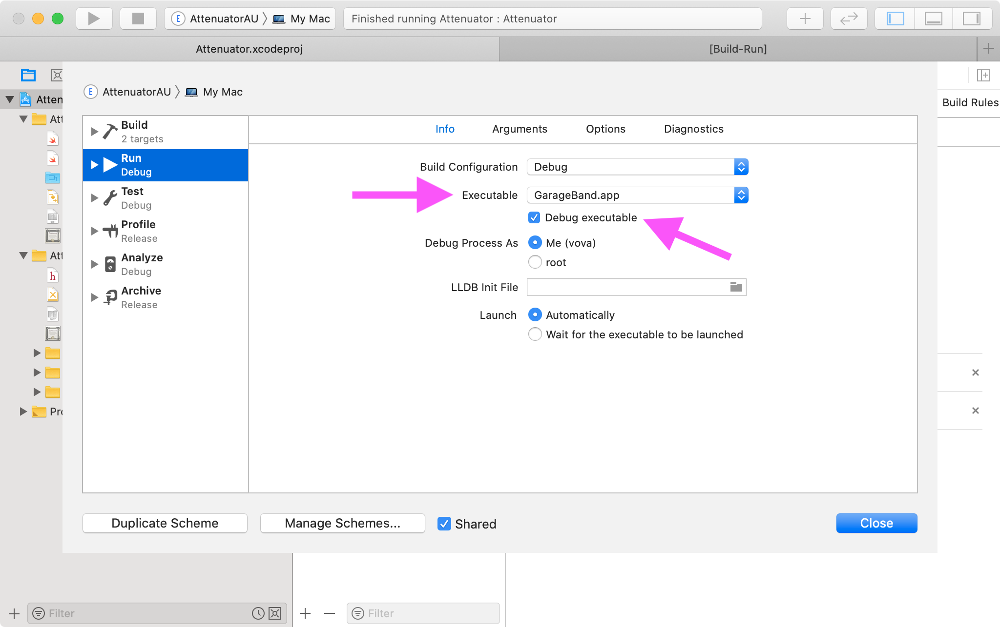

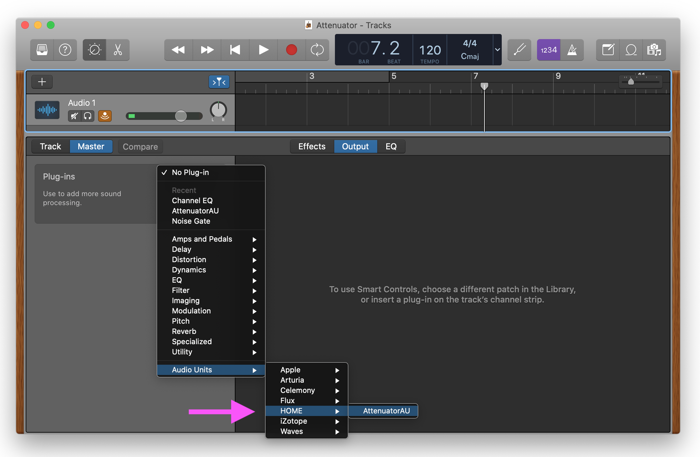

**Note** ⚠️: If you are getting error `EXC_BAD_INSTRUCTION (code=EXC_I386_INVOP, subcode=0x0)` try to enable **Thread sanitizer** in Run configuration.

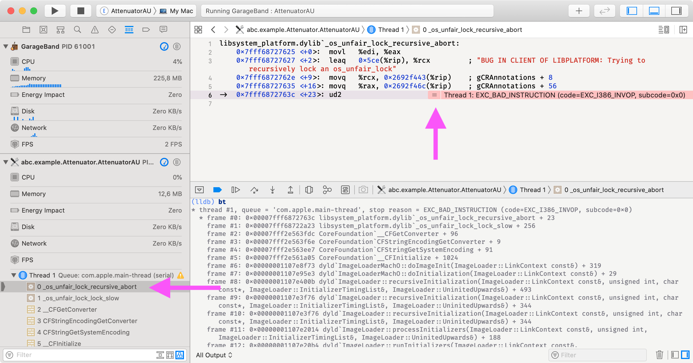

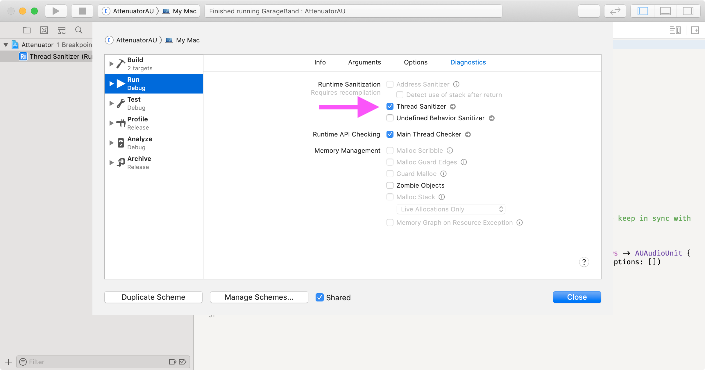

While GarageBand.app is running, the plug-in temporary remains registered in the system. So, we can also check presence of it in system by using `auval` tool.

```bash
$ auval -s aufx 2>/dev/null

    AU Validation Tool
    Version: 1.7.0
    Copyright 2003-2019, Apple Inc. All Rights Reserved.
    Specify -h (-help) for command options

aufx attr HOME  -  HOME: AttenuatorAU ⬅️
aufx bpas appl  -  Apple: AUBandpass
aufx dcmp appl  -  Apple: AUDynamicsProcessor
...
aufx tmpt appl  -  Apple: AUPitch
```

We can even validate plug-in in `auval` tool.

```bash
$ auval -v aufx attr HOME

    AU Validation Tool
    Version: 1.7.0
    Copyright 2003-2019, Apple Inc. All Rights Reserved.
    Specify -h (-help) for command options

--------------------------------------------------
VALIDATING AUDIO UNIT: 'aufx' - 'attr' - 'HOME'
--------------------------------------------------
Manufacturer String: HOME
AudioUnit Name: AttenuatorAU
Component Version: 1.6.0 (0x10600)

...

* * PASS
--------------------------------------------------
AU VALIDATION SUCCEEDED.
--------------------------------------------------
```

Another way to check if the plug-in registered in system, is to use `pluginkit` tool.

```bash
$ pluginkit -m

     com.apple.AppSSOKerberos.KerberosExtension(1.0)
     com.apple.diagnosticextensions.osx.timemachine(1.0)
!    abc.example.Attenuator.AttenuatorAU(1.0) ⬅️
+    com.apple.share.System.add-to-safari-reading-list(641.6)
+    com.apple.ncplugin.weather(1.0)
     com.apple.diagnosticextensions.osx.syslog(1.0)
     com.apple.RemoteManagement.PasscodeSettingsExtension(1.0)
     ...
```

**Note** ⚠️: Once we will stop debug session in GarageBang.app or in Juce AudioPluginHost.app. The plug-in will be unregistered from the system.

```bash
$ auval -s aufx 2>/dev/null

    AU Validation Tool
    Version: 1.7.0
    Copyright 2003-2019, Apple Inc. All Rights Reserved.
    Specify -h (-help) for command options

aufx bpas appl  -  Apple: AUBandpass
aufx dcmp appl  -  Apple: AUDynamicsProcessor
...
aufx tmpt appl  -  Apple: AUPitch
```

```bash
$ pluginkit -m

     com.apple.AppSSOKerberos.KerberosExtension(1.0)
     com.apple.diagnosticextensions.osx.timemachine(1.0)
+    com.apple.share.System.add-to-safari-reading-list(641.6)
+    com.apple.ncplugin.weather(1.0)
     com.apple.diagnosticextensions.osx.syslog(1.0)
     com.apple.RemoteManagement.PasscodeSettingsExtension(1.0)
     ...
```

Here is how plug-in works in [AudioPluginHost](https://github.com/WeAreROLI/JUCE/tree/master/extras/AudioPluginHost/Builds/MacOSX) from [JUCE SDK](https://juce.com).

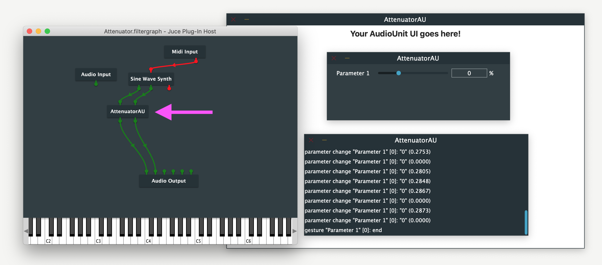

I found JUCE host better then GarageBand.app because it allows to automate plug-in parameters. This is significant value for testing.

Summary of this step marked with git tag [01-PlugIn-Scaffold](https://github.com/vgorloff/mc-blog-swiftui-in-auv3/tags).

## Refactoring DSP and UI implementation <a name="chapter-2"></a>

Xcode created default implementation of AudioUnit, DSP processor and Helper classes. For our Attenuator plug-in we don't need code related to MIDI events processing. Also we want to use Swift as much as possible. Plus we want to use SwiftUI in a plug-in view.

After refactoring project structure will look like below.

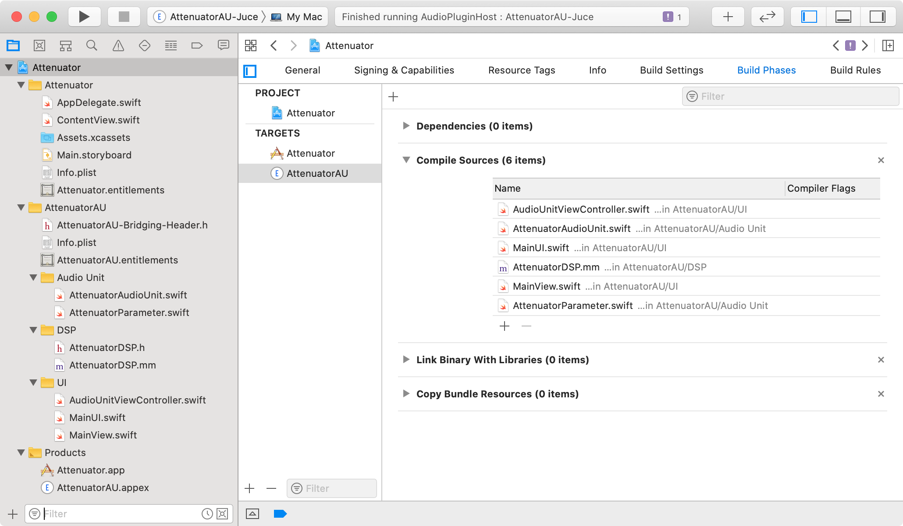

```c
// AttenuatorAU-Bridging-Header.h

#import "AttenuatorDSP.h"
```

```objc
// AttenuatorDSP.h

#ifndef AttenuatorDSP_h
#define AttenuatorDSP_h

#import <AudioToolbox/AudioToolbox.h>

@interface AttenuatorDSP: NSObject

@property (nonatomic) float paramGain;
@property (nonatomic) bool isBypassed;
@property (nonatomic) uint numberOfChannels;

-(void)process:(AUAudioFrameCount)frameCount inBufferListPtr:(AudioBufferList*)inBufferListPtr outBufferListPtr:(AudioBufferList*)outBufferListPtr;

@end

#endif /* AttenuatorDSP_h */
```

DSP not doing any work related to bus management. It just altering input data to output data based on current plug-in parameters.

```objc
// AttenuatorDSP.mm

#include "AttenuatorDSP.h"

@implementation AttenuatorDSP

- (instancetype)init {
   self = [super init];
   if (self) {
      self.paramGain = 1;
   }
   return self;
}

- (void)process:(AUAudioFrameCount)frameCount inBufferListPtr:(AudioBufferList*)inBufferListPtr outBufferListPtr:(AudioBufferList*)outBufferListPtr {

   for (int channel = 0; channel < _numberOfChannels; ++channel) {
      if (_isBypassed) {
         if (inBufferListPtr->mBuffers[channel].mData == outBufferListPtr->mBuffers[channel].mData) {
            continue;
         }
      }

      // Get pointer to immutable input buffer and mutable output buffer
      const float* inPtr = (float*)inBufferListPtr->mBuffers[channel].mData;
      float* outPtr = (float*)outBufferListPtr->mBuffers[channel].mData;

      // Perform per sample dsp on the incoming float `inPtr` before asigning it to `outPtr`
      for (int frameIndex = 0; frameIndex < frameCount; ++frameIndex) {
         if (_isBypassed) {
            outPtr[frameIndex] = inPtr[frameIndex];
         } else {
            outPtr[frameIndex] = _paramGain * inPtr[frameIndex];
         }
      }
   }
}

@end
```

```swift
// AttenuatorParameter.swift

import Foundation
import AudioUnit

enum AttenuatorParameter: UInt64 {

   case gain = 1000

   static func fromRawValue(_ rawValue: UInt64) -> AttenuatorParameter {
      if let value = AttenuatorParameter(rawValue: rawValue) {
         return value
      }
      fatalError()
   }

   var parameterID: String {
      let prefix = "paramID:"
      switch self {
      case .gain: return prefix + "Gain"
      }
   }

   var name: String {
      switch self {
      case .gain: return "Gain"
      }
   }

   var min: AUValue {
      switch self {
      case .gain: return 0
      }
   }

   var max: AUValue {
      switch self {
      case .gain: return 1
      }
   }

   var defaultValue: AUValue {
      switch self {
      case .gain: return 1
      }
   }

   func stringFromValue(value: AUValue) -> String {
      switch self {
      case .gain: return "\(value)"
      }
   }
}
```

AudioUnit subclass performs all work related to bus management and buffer allocation.

```swift
// AttenuatorAudioUnit.swift

import AudioUnit
import AVFoundation

class AttenuatorAudioUnit: AUAudioUnit {

   public enum Error: Swift.Error {
      case statusError(OSStatus)
      case unableToInitialize(String)
   }

   private let maxNumberOfChannels: UInt32 = 8
   private let maxFramesToRender: UInt32 = 512

   private var _parameterTree: AUParameterTree!
   private(set) var parameterGain: AUParameter!

   private let dsp = AttenuatorDSP()

   private var inputBus: AUAudioUnitBus
   private var outputBus: AUAudioUnitBus
   private var outPCMBuffer: AVAudioPCMBuffer

   private var _inputBusses: AUAudioUnitBusArray!
   private var _outputBusses: AUAudioUnitBusArray!

   override init(componentDescription: AudioComponentDescription, options: AudioComponentInstantiationOptions) throws {

      guard let format = AVAudioFormat(standardFormatWithSampleRate: 44100, channels: 2) else {
         throw Error.unableToInitialize(String(describing: AVAudioFormat.self))
      }
      inputBus = try AUAudioUnitBus(format: format)
      inputBus.maximumChannelCount = maxNumberOfChannels
      outputBus = try AUAudioUnitBus(format: format)
      outputBus.maximumChannelCount = maxNumberOfChannels

      guard let pcmBuffer = AVAudioPCMBuffer(pcmFormat: format, frameCapacity: maxFramesToRender) else {
         throw Error.unableToInitialize(String(describing: AVAudioPCMBuffer.self))
      }
      pcmBuffer.frameLength = maxFramesToRender
      outPCMBuffer = pcmBuffer

      dsp.numberOfChannels = format.channelCount
      dsp.paramGain = AttenuatorParameter.gain.defaultValue

      try super.init(componentDescription: componentDescription, options: options)
      self.maximumFramesToRender = maxFramesToRender

      _parameterTree = setUpParametersTree()
      _inputBusses = AUAudioUnitBusArray(audioUnit: self, busType: AUAudioUnitBusType.input, busses: [inputBus])
      _outputBusses = AUAudioUnitBusArray(audioUnit: self, busType: AUAudioUnitBusType.output, busses: [outputBus])
   }

   override var parameterTree: AUParameterTree? {
      get {
         return _parameterTree
      } set {
         fatalError()
      }
   }

   override var shouldBypassEffect: Bool {
      get {
         return dsp.isBypassed
      } set {
         dsp.isBypassed = newValue
      }
   }

   public override var inputBusses: AUAudioUnitBusArray {
      return _inputBusses
   }

   public override var outputBusses: AUAudioUnitBusArray {
      return _outputBusses
   }

   override func allocateRenderResources() throws {
      // Should be equal as we created it with the same format.
      if outputBus.format.channelCount != inputBus.format.channelCount {
         setRenderResourcesAllocated(false)
         throw Error.statusError(kAudioUnitErr_FailedInitialization)
      }
      try super.allocateRenderResources()
      guard let pcmBuffer = AVAudioPCMBuffer(pcmFormat: inputBus.format, frameCapacity: maximumFramesToRender) else {
         throw Error.unableToInitialize(String(describing: AVAudioPCMBuffer.self))
      }
      pcmBuffer.frameLength = maxFramesToRender
      outPCMBuffer = pcmBuffer
      dsp.numberOfChannels = outputBus.format.channelCount
   }

   override var internalRenderBlock: AUInternalRenderBlock {
      return { [weak self] _, timestamp, frameCount, outputBusNumber, outputData, _, pullInputBlock in

         guard let this = self else {
            return kAudioUnitErr_NoConnection
         }
         if frameCount > this.maximumFramesToRender {
            return kAudioUnitErr_TooManyFramesToProcess;
         }

         guard let pullInputBlock = pullInputBlock else {
            return kAudioUnitErr_NoConnection
         }

         var pullFlags: AudioUnitRenderActionFlags = []

         let inputData = this.outPCMBuffer.mutableAudioBufferList
         // Instead of `inputBusNumber` we can also pass `0`
         let status = pullInputBlock(&pullFlags, timestamp, frameCount, outputBusNumber, inputData)

         if status != noErr {
            return status
         }

         /*
          Important:
          If the caller passed non-null output pointers (outputData->mBuffers[x].mData), use those.

          If the caller passed null output buffer pointers, process in memory owned by the Audio Unit
          and modify the (outputData->mBuffers[x].mData) pointers to point to this owned memory.
          The Audio Unit is responsible for preserving the validity of this memory until the next call to render,
          or deallocateRenderResources is called.

          If your algorithm cannot process in-place, you will need to preallocate an output buffer
          and use it here.

          See the description of the canProcessInPlace property.
          */
         let inListPointer = UnsafeMutableAudioBufferListPointer(inputData)
         let outListPointer = UnsafeMutableAudioBufferListPointer(outputData)
         for indexOfBuffer in 0 ..< outListPointer.count {
            // Should be equal by default.
            outListPointer[indexOfBuffer].mNumberChannels = inListPointer[indexOfBuffer].mNumberChannels
            outListPointer[indexOfBuffer].mDataByteSize = inListPointer[indexOfBuffer].mDataByteSize
            if outListPointer[indexOfBuffer].mData == nil {
               outListPointer[indexOfBuffer].mData = inListPointer[indexOfBuffer].mData
            }
         }

         this.dsp.process(frameCount, inBufferListPtr: inputData, outBufferListPtr: outputData)

         return status
      }
   }

   // MARK: - Private

   private func setUpParametersTree() -> AUParameterTree {
      let pGain = AttenuatorParameter.gain
      parameterGain = AUParameterTree.createParameter(withIdentifier: pGain.parameterID,
                                                      name: pGain.name, address: pGain.rawValue, min: pGain.min, max: pGain.max,
                                                      unit: AudioUnitParameterUnit.linearGain, unitName: nil, flags: [],
                                                      valueStrings: nil, dependentParameters: nil)
      parameterGain.value = pGain.defaultValue
      let tree = AUParameterTree.createTree(withChildren: [parameterGain])
      tree.implementorStringFromValueCallback = { param, value in
         guard let paramValue = value?.pointee else {
            return "-"
         }
         let param = AttenuatorParameter.fromRawValue(param.address)
         return param.stringFromValue(value: paramValue)
      }
      tree.implementorValueObserver = { [weak self] param, value in
         let param = AttenuatorParameter.fromRawValue(param.address)
         switch param {
         case .gain:
            self?.dsp.paramGain = value
         }
      }
      tree.implementorValueProvider = { [weak self] param in guard let s = self else { return AUValue() }
         let param = AttenuatorParameter.fromRawValue(param.address)
         switch param {
         case .gain:
            return s.dsp.paramGain;
         }
      }
      return tree
   }
}
```

View controller acts as a factory and a clue between UI and AudioUnit.

```swift
// AudioUnitViewController.swift

import CoreAudioKit

public class AudioUnitViewController: AUViewController, AUAudioUnitFactory {

   private lazy var auView = MainView()
   var audioUnit: AttenuatorAudioUnit?
   private var parameterObserverToken: AUParameterObserverToken?
   private var isConfigured = false

   public override func loadView() {
      view = auView
      preferredContentSize = NSSize(width: 200, height: 150)
   }

   public override var preferredMaximumSize: NSSize {
      return NSSize(width: 800, height: 600)
   }

   public override var preferredMinimumSize: NSSize {
      return NSSize(width: 200, height: 150)
   }

   public override func viewDidLoad() {
      super.viewDidLoad()
      setupViewIfNeeded()
   }

   public func createAudioUnit(with componentDescription: AudioComponentDescription) throws -> AUAudioUnit {
      let au = try AttenuatorAudioUnit(componentDescription: componentDescription, options: [])
      audioUnit = au
      DispatchQueue.main.async {
         self.setupViewIfNeeded()
      }
      return au
   }

   private func setupViewIfNeeded() {
      if !isConfigured, let au = audioUnit {
         isConfigured = true
         setupUI(au: au)
      }
   }

   private func setupUI(au: AttenuatorAudioUnit) {
      auView.setGain(au.parameterGain.value)
      parameterObserverToken = au.parameterTree?.token(byAddingParameterObserver: { address, value in
         DispatchQueue.main.async { [weak self] in
            let paramType = AttenuatorParameter.fromRawValue(address)
            switch paramType {
            case .gain:
               self?.auView.setGain(value)
            }
         }
      })
      auView.onDidChange = { [weak self] value in
         if let token = self?.parameterObserverToken {
           self?.audioUnit?.parameterGain?.setValue(value, originator: token)
         }
      }
   }
}
```

```swift
// MainView.swift

import Foundation
import SwiftUI

final class SliderData: ObservableObject {

   @Published var gain: Float = 100
}

class MainView: NSView {

   private let sliderData = SliderData()

   var onDidChange: ((Float) -> Void)?

   override init(frame frameRect: NSRect) {
      super.init(frame: frameRect)
      wantsLayer = true
      layer?.backgroundColor = NSColor.lightGray.cgColor
      let view = NSHostingView(rootView: MainUI { [weak self] in
         let value = $0 / 100
         print("MainView> Value to Host: \(value)")
         self?.onDidChange?(value)
      }.environmentObject(sliderData))
      view.translatesAutoresizingMaskIntoConstraints = false
      addSubview(view)
      leadingAnchor.constraint(equalTo: view.leadingAnchor).isActive = true
      trailingAnchor.constraint(equalTo: view.trailingAnchor).isActive = true
      topAnchor.constraint(equalTo: view.topAnchor).isActive = true
      bottomAnchor.constraint(equalTo: view.bottomAnchor).isActive = true
   }

   required dynamic init?(coder aDecoder: NSCoder) {
      fatalError()
   }

   func setGain(_ value: Float) {
      print("MainView> Value from Host: \(value)")
      sliderData.gain = 100 * value
   }
}
```

View contains Slider to control value of the gain parameter.

```swift
// MainUI.swift

import Foundation
import Combine
import SwiftUI

struct MainUI: View {

   @EnvironmentObject var sliderData: SliderData
   @State var gain: Float = 100

   private var onChanged: (Float) -> Void

   init(onChanged: @escaping (Float) -> Void) {
      self.onChanged = onChanged
   }

   var body: some View {
      VStack {
         Slider(value: Binding<Float>(get: { self.gain }, set: {
            self.gain = $0
            self.onChanged($0)
         }), in: 0...100, step: 2)
         Text("Gain: \(Int(gain))")
      }.onReceive(sliderData.$gain, perform: { self.gain = $0 })
   }
}
```

Here is how refactored plug-in looks in Juce AudioPluginHost.app.

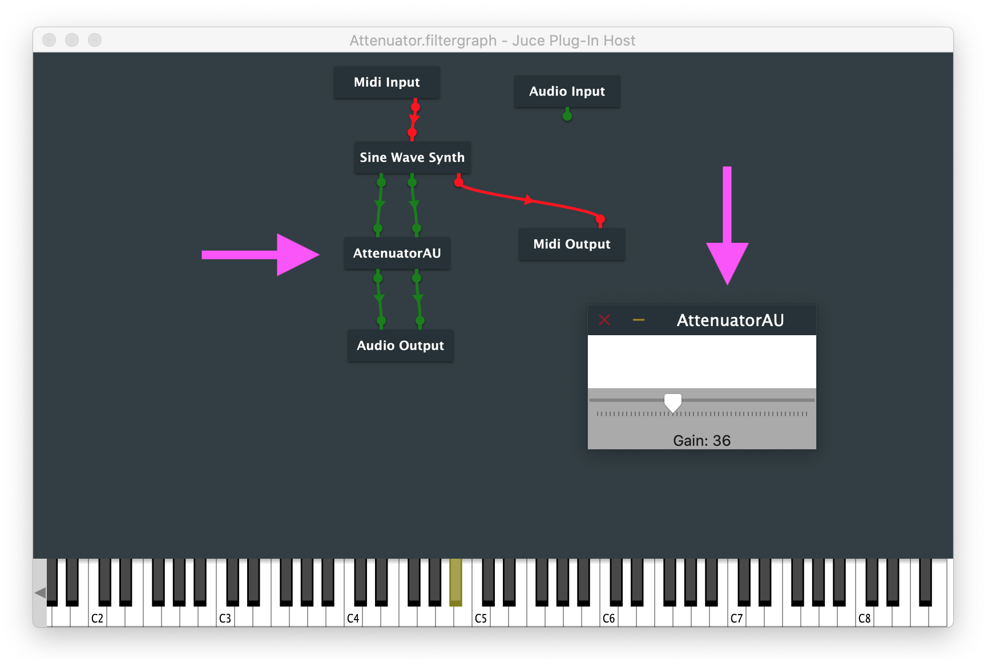

Summary of this step marked with git tag [02-Refactored-PlugIn-Code](https://github.com/vgorloff/mc-blog-swiftui-in-auv3/tags).

## Adding VU meter backed by Metal <a name="chapter-3"></a>

Now we have a simple Attenuator plug-in. Lets add VU meter which will show level of incoming signal.

First, on DSP side, we need to calculate maximum magnitude value.

```objs

// AttenuatorDSP.h

#ifndef AttenuatorDSP_h
#define AttenuatorDSP_h

#import <AudioToolbox/AudioToolbox.h>

@interface AttenuatorDSP: NSObject

@property (nonatomic) float paramGain;
@property (nonatomic) bool isBypassed;
@property (nonatomic) uint numberOfChannels;

// Used by VU meter on UI side 1️⃣.
@property (nonatomic) float maximumMagnitude;

-(void)process:(AUAudioFrameCount)frameCount inBufferListPtr:(AudioBufferList*)inBufferListPtr outBufferListPtr:(AudioBufferList*)outBufferListPtr;

@end

#endif /* AttenuatorDSP_h */
```

```objc
// AttenuatorDSP.mm

#include "AttenuatorDSP.h"

@implementation AttenuatorDSP

// ..

- (void)process:(AUAudioFrameCount)frameCount inBufferListPtr:(AudioBufferList*)inBufferListPtr outBufferListPtr:(AudioBufferList*)outBufferListPtr {

   _maximumMagnitude = 0;
   for (int channel = 0; channel < _numberOfChannels; ++channel) {
      // Get pointer to immutable input buffer and mutable output buffer
      const float* inPtr = (float*)inBufferListPtr->mBuffers[channel].mData;
      float* outPtr = (float*)outBufferListPtr->mBuffers[channel].mData;

      // Perform per sample dsp on the incoming float `inPtr` before asigning it to `outPtr`
      for (int frameIndex = 0; frameIndex < frameCount; ++frameIndex) {
         float value = inPtr[frameIndex];
         if (!_isBypassed) {
            value *= _paramGain;
         }
         outPtr[frameIndex] = value;
         _maximumMagnitude = fmax(_maximumMagnitude, value); // 2️⃣ Saving max magnitude.
      }
   }
}

@end
```

Then we need to create Metal view which will render VU level.

```swift
// VUView.swift

import Foundation
import MetalKit

class VUView: MTKView {

   public enum Error: Swift.Error {
      case unableToInitialize(Any.Type)
   }

   private(set) var viewportSize = vector_float2(100, 100)

   private var metalDevice: MTLDevice!
   private var library: MTLLibrary!
   private var commandQueue: MTLCommandQueue!
   private var pipelineState: MTLRenderPipelineState!

   private var colorData = vector_float4(0, 0, 1, 1)
   private var verticesData = [vector_float2]()
   private var level: Float = 0

   var onRender: (() -> Float)?

   init(thisIsNeededToMakeSwiftCompilerHapy: Bool = true) throws {
      let device = MTLCreateSystemDefaultDevice()
      super.init(frame: .zero, device: device)

      // Clear color. See: https://forums.developer.apple.com/thread/26461
      clearColor = MTLClearColorMake(0, 0, 0, 0)

      if let device = device {
         metalDevice = device
         colorPixelFormat = MTLPixelFormat.bgra8Unorm // Actually it is default value
         delegate = self
      } else {
         throw Error.unableToInitialize(MTLDevice.self)
      }

      guard let url = Bundle(for: type(of: self)).url(forResource: "default", withExtension: "metallib") else {
         throw Error.unableToInitialize(URL.self)
      }

      library = try metalDevice.makeLibrary(filepath: url.path)
      guard let commandQueue = metalDevice.makeCommandQueue() else {
         throw Error.unableToInitialize(MTLCommandQueue.self)
      }
      self.commandQueue = commandQueue

      guard let vertexProgram = library.makeFunction(name: "vertex_line") else {
         throw Error.unableToInitialize(MTLFunction.self)
      }
      guard let fragmentProgram = library.makeFunction(name: "fragment_line") else {
         throw Error.unableToInitialize(MTLFunction.self)
      }

      let pipelineStateDescriptor = MTLRenderPipelineDescriptor()
      pipelineStateDescriptor.vertexFunction = vertexProgram
      pipelineStateDescriptor.fragmentFunction = fragmentProgram
      // Alternatively can be set from drawable.texture.pixelFormat
      pipelineStateDescriptor.colorAttachments[0].pixelFormat = colorPixelFormat
      pipelineState = try metalDevice.makeRenderPipelineState(descriptor: pipelineStateDescriptor)
   }

   required init(coder: NSCoder) {
      fatalError()
   }
}

extension VUView: MTKViewDelegate {

   func mtkView(_ view: MTKView, drawableSizeWillChange size: CGSize) {
      viewportSize.x = Float(size.width)
      viewportSize.y = Float(size.height)
   }

   func draw(in view: MTKView) {
      if inLiveResize {
         return
      }
      if let drawable = currentDrawable, let descriptor = currentRenderPassDescriptor {
         autoreleasepool {
            do {
               try render(drawable: drawable, renderPassDescriptor: descriptor)
            } catch {
               print(String(describing: error))
               assertionFailure(String(describing: error))
            }
         }
      }
   }

}

extension VUView {

   func render(drawable: CAMetalDrawable, renderPassDescriptor: MTLRenderPassDescriptor) throws {
      guard let commandBuffer = commandQueue.makeCommandBuffer() else {
         throw Error.unableToInitialize(MTLCommandBuffer.self)
      }

      // Transparent Metal background. See: https://forums.developer.apple.com/thread/26461
      renderPassDescriptor.colorAttachments[0].loadAction = .clear

      guard let renderEncoder = commandBuffer.makeRenderCommandEncoder(descriptor: renderPassDescriptor) else {
         throw Error.unableToInitialize(MTLRenderCommandEncoder.self)
      }

      do {
         renderEncoder.setRenderPipelineState(pipelineState)

         let width = Double(viewportSize.x)
         let height = Double(viewportSize.y)
         let viewPort = MTLViewport(originX: 0, originY: 0, width: width, height: height, znear: 0, zfar: 1)
         renderEncoder.setViewport(viewPort)
         try prepareEncoder(encoder: renderEncoder)

         renderEncoder.endEncoding()

         commandBuffer.present(drawable)
         commandBuffer.commit()
      } catch {
         renderEncoder.endEncoding()
         throw error
      }
   }

   func prepareEncoder(encoder: MTLRenderCommandEncoder) throws {

      verticesData.removeAll(keepingCapacity: true)
      level = onRender?() ?? 0
      if level <= 0 {
         return
      }

      let x = max(Float(viewportSize.x * level), 1)
      let vertices = makeRectangle(xMin: 0, xMax: x, yMin: 0, yMax: viewportSize.y)
      verticesData += vertices

      encoder.setVertexBytes(&verticesData, length: verticesData.count * MemoryLayout<vector_float2>.stride, index: 0)
      encoder.setVertexBytes(&colorData, length: MemoryLayout<vector_float4>.stride, index: 1)
      encoder.setVertexBytes(&viewportSize, length: MemoryLayout<vector_float2>.stride, index: 2)

      encoder.drawPrimitives(type: .triangle, vertexStart: 0, vertexCount: verticesData.count)
   }

   func makeRectangle(xMin: Float, xMax: Float, yMin: Float, yMax: Float) -> [vector_float2] {
      // Adding 2 triangles to represent recrtangle.
      return [vector_float2(xMin, yMin), vector_float2(xMin, yMax), vector_float2(xMax, yMax),
              vector_float2(xMin, yMin), vector_float2(xMax, yMax), vector_float2(xMax, yMin)]
   }
}
```

And of cause we need to create Metal shaders.

```cpp
// VUView.metal

#include <metal_stdlib>
using namespace metal;

struct ColoredVertex {
   float4 position [[position]];
   float4 color;
};

vertex ColoredVertex
vertex_line(uint vid [[vertex_id]],
                constant vector_float2 *positions [[buffer(0)]],
                constant vector_float4 *color [[buffer(1)]],
                constant vector_float2 *viewportSizePointer [[buffer(2)]]) {

   vector_float2 viewportSize = *viewportSizePointer;
   vector_float2 pixelSpacePosition = positions[vid].xy;

   ColoredVertex vert;
   vert.position = vector_float4(0.0, 0.0, 0.0, 1.0);
   vert.position.xy = (pixelSpacePosition / (viewportSize / 2.0)) - 1.0;
   vert.color = *color;
   return vert;
}

fragment float4
fragment_line(ColoredVertex vert [[stage_in]]) {
   return vert.color;
}
```

Drawing model and maximum magnitude wired together in a view controller, via callback.

```swift

// AudioUnitViewController.swift

   // ...

   private func setupUI(au: AttenuatorAudioUnit) {
      auView.setGain(au.parameterGain.value)
      parameterObserverToken = au.parameterTree?.token(byAddingParameterObserver: { address, value in
         DispatchQueue.main.async { [weak self] in
            let paramType = AttenuatorParameter.fromRawValue(address)
            switch paramType {
            case .gain:
               self?.auView.setGain(value)
            }
         }
      })
      auView.onDidChange = { [weak self] value in
         if let token = self?.parameterObserverToken {
            self?.audioUnit?.parameterGain?.setValue(value, originator: token)
         }
      }
      // 1️⃣ Connecting UI and DSP.
      auView.onRender = { [weak self] in
         self?.audioUnit?.maximumMagnitude ?? 0
      }
   }
```

Finally we have a plug-in with visual feedback, which shows volume level of incoming signal.

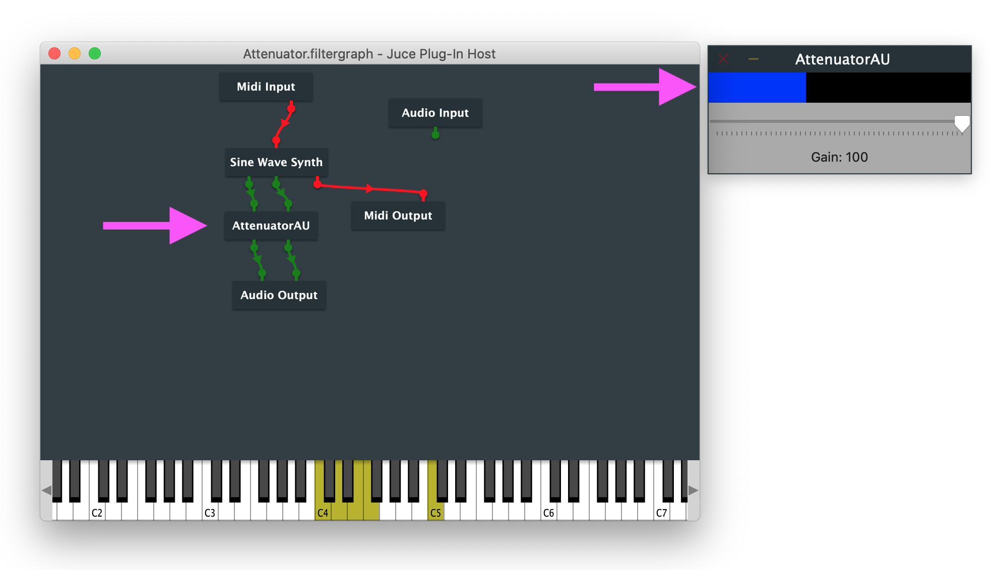

Summary of this step marked with git tag [03-Created-VU-Meter](https://github.com/vgorloff/mc-blog-swiftui-in-auv3/tags).

Happy coding! 🙃

Sources of Plug-In can be found at [GitHub](https://github.com/vgorloff/mc-blog-swiftui-in-auv3).
