## On this Page

- [Preparations](#chapter-1)
- [Creating Plug-In scaffold](#chapter-2)
- [Creating Processing part of Plug-In](#chapter-3)
- [Creating Editor part of Plug-In](#chapter-4)

Let's make an [Audio Plug-In](https://github.com/vgorloff/mc-blog-swiftui-in-vst2) in VST 2.4.2 format which uses SwiftUI in Effect editor. The processor part of this plug-in will change the gain of incoming audio signal.

Few historical notes:

[Virtual Studio Technology - Wikipedia](https://en.wikipedia.org/wiki/Virtual_Studio_Technology)

> VST was developed by Steinberg Media Technologies in **1996**. It creates a complete, professional studio environment on the PC or Mac.

[Swift (programming language) - Wikipedia](<https://en.wikipedia.org/wiki/Swift_(programming_language)>)

> During WWDC **2019**, Apple announced SwiftUI, which provides a framework for declarative UI structure design across all Apple platforms.

In this tutorial we will use VST SDK v2.4.2 which was published in 2006. Thus the distance in time between two technologies is **13** years 🙀.

## Preparations <a name="chapter-1"></a>

We need tree pieces: Xcode 11.4, VST SDK v2.4.2 and VST Host software to run our audio plug-in.

### Xcode

The easiest part is to get Xcode 11.4. It can be downloaded from [Mac App Store](https://apps.apple.com/us/app/xcode/id497799835?mt=12) or from [Apple Developer portal](https://developer.apple.com/download/more/).

### VST Host software

For VST Host software we can use [Renoise 3.2.1](https://www.renoise.com/download). Demo version of this app has several limitations, but it is enough to run our plug-in in **debug** mode. Another good VST Host is a [REAPER](https://www.reaper.fm/download.php). But it has protection against debugging and reverse engineering. So, we can use it to test plug-in in **non-debug** mode only.

### VST SDK v2.4.2

Most interesting part is to get VST SDK v2.4.2. It is discounted and not available for download anymore from official [Steinberg website](https://www.steinberg.net/en/company/developers.html).

> One more thing we would like to point out at this stage: with the release of the [VST 3.6.11](https://www.steinberg.net/en/newsandevents/news/newsdetail/article/vst-3611-sdk-now-available-4906.html), **the SDK for VST 2 has officially been discontinued**. We are happy that third-party developers are now looking forward and will continue VST plug-in development with the SDK of VST 3.

A lot of VST Host software still using VST SDK v2.4.2 plug-ins due their simplicity. Also worth to mention that not every VST Host software has newer VST3 audio plug-ins support. There is a various of discussions about VST SDK v2.4.2 deprecation.

- [VST SDK 3.6.12 - Audio Plugins - JUCE](https://forum.juce.com/t/vst-sdk-3-6-12/30703)
- [The removal of JUCE embedded VST2 SDK - Audio Plugins - JUCE](https://forum.juce.com/t/the-removal-of-juce-s-embedded-vst2-sdk/29994)

**BUT**. We still can download VST SDK v2.4.2 from internet archives. Here is some links:

- [Internet Archive: VST2 SDK](https://archive.org/details/VST2SDK) - will be used in this tutorial ✅.
- [Wayback Machine: VST SDK 3.6.11](https://web.archive.org/web/20181016150224/https://download.steinberg.net/sdk_downloads/vstsdk3610_11_06_2018_build_37.zip) - includes VST2 SDK.

Another way – is to extract VST SDK v2.4.2 sources from projects hosted on GitHub.

- [GitHub Search · aeffect.h](https://github.com/search?l=C%2B%2B&p=2&q=aeffect.h&type=Code)

In this tutorial we will use VST SDK v2.4.2 from [Internet Archive](https://archive.org/details/VST2SDK) website.

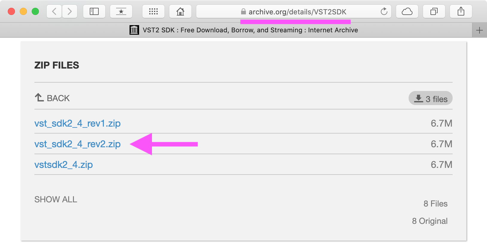

After downloading you should have file structure like shown below. Whole VST SDK v2.4.2 consists with only **9** files 🙃.

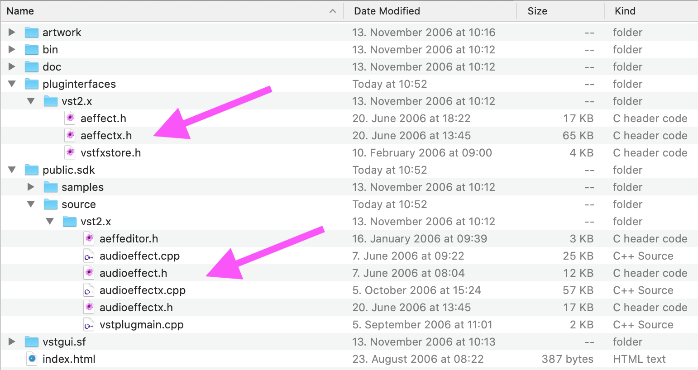

## Creating Plug-In scaffold <a name="chapter-2"></a>

First we need to make a scaffold of the plug-in Xcode project with integrated VST SDK v2.4.2.

1. Configure path to VST SDK v2.4.2 in Xcode. We will use this setting later in the project ✅.

   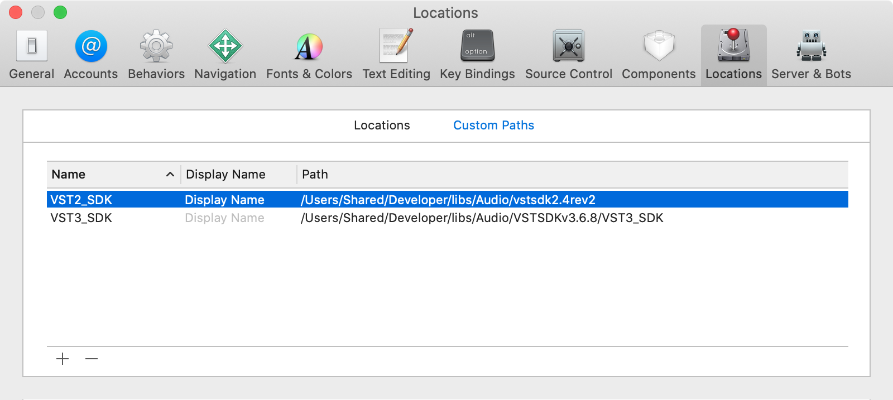

2. Create Xcode project with two frameworks. First Obj-C Framework with name **AttenuatorVST2** – the processor, and second Swift Framework with name **AttenuatorVST2UI** – an editor.

   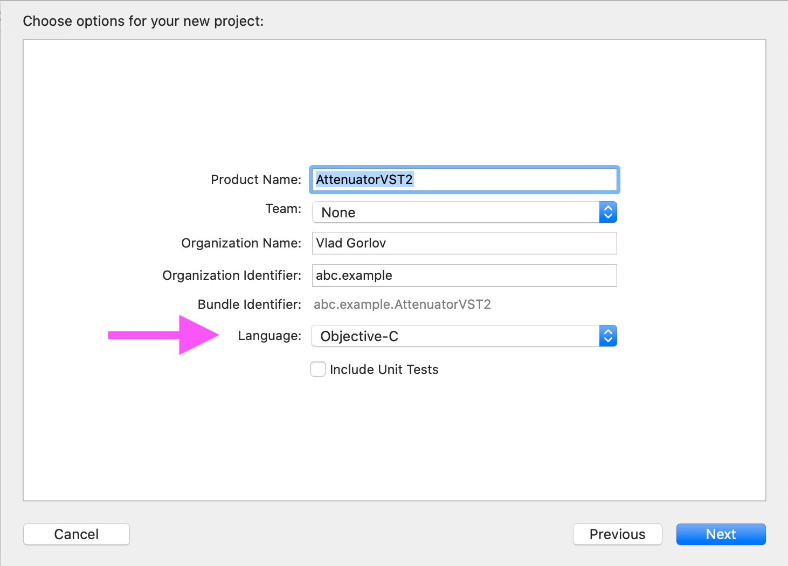
   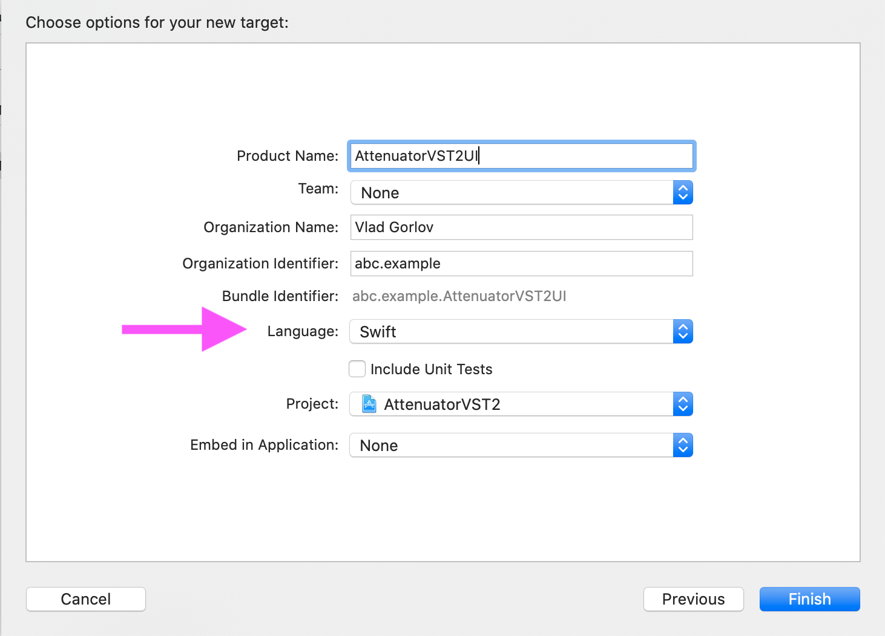

3. Establish dependency between AttenuatorVST2 and AttenuatorVST2UI frameworks.

   ⚠️ **Note**: The framework AttenuatorVST2UI should be not only liked, but also **copied** into Frameworks folder inside AttenuatorVST2.

   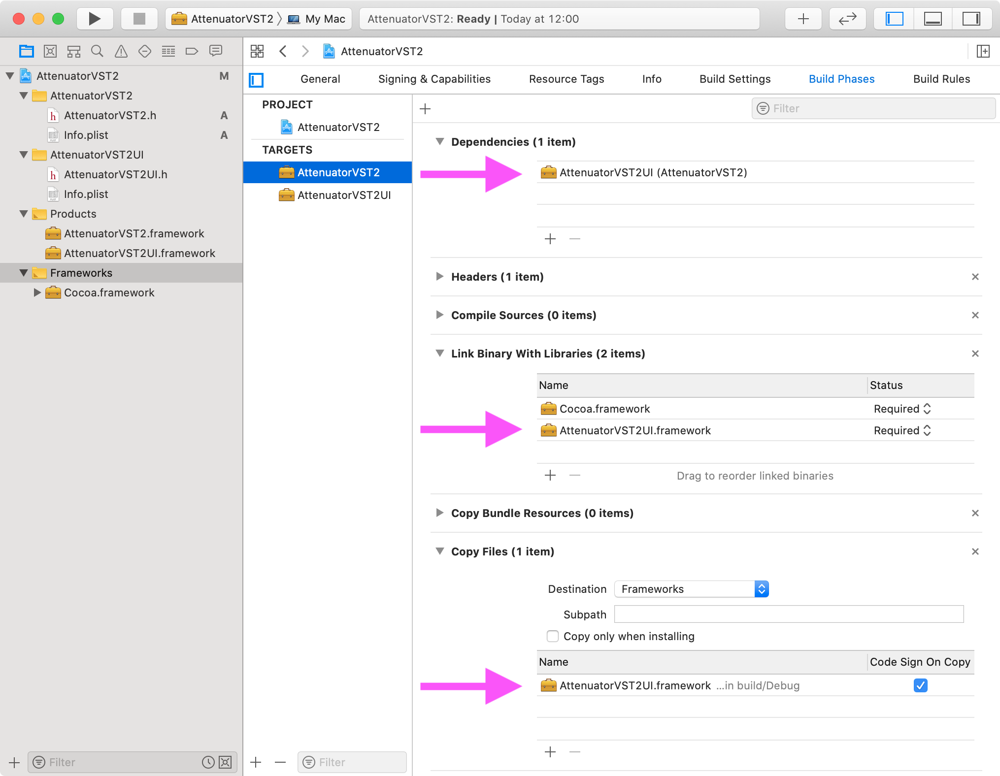

Now we have scaffold of the plug-in Xcode project. You can build it. The framework AttenuatorVST2UI should be bundled inside framework AttenuatorVST.

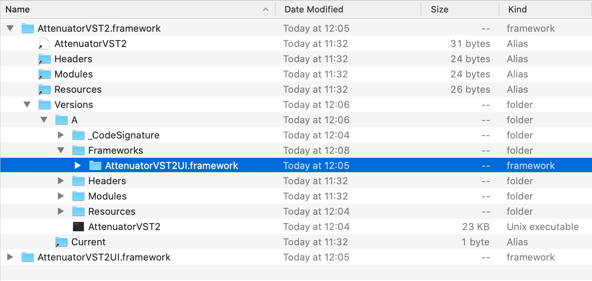

Summary of this step marked with git tag [Creating-Plug-In-scaffold](https://github.com/vgorloff/mc-blog-swiftui-in-vst2/tags).

## Creating Processing part of Plug-In <a name="chapter-3"></a>

Time to write some C++ code.

1. Add to the framework AttenuatorVST2 two C++ classes: `AttenuatorProcessor.cpp` and `AttenuatorEditor.cpp`.
2. Add to the framework AttenuatorVST2 one C++ file (without header): `vst2sdk.cpp`.
3. Replace contents file `vst2sdk.cpp` with code shown below.

   ```cpp
   #include "vstplugmain.cpp"
   #include "audioeffect.cpp"
   #include "audioeffectx.cpp"
   ```

After adding processor sources the structure will look like shown below.

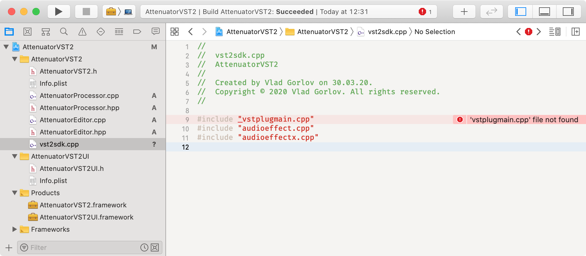

Xcode already showing missed file error 📛. We need to update build settings for framework **AttenuatorVST2**. The easiest way is to create `AttenuatorVST2.xcconfig` file and assign it to AttenuatorVST2 target in Xcode project preferences.

```xcconfig
// AttenuatorVST2.xcconfig

HEADER_SEARCH_PATHS = $(VST2_SDK)/**
```

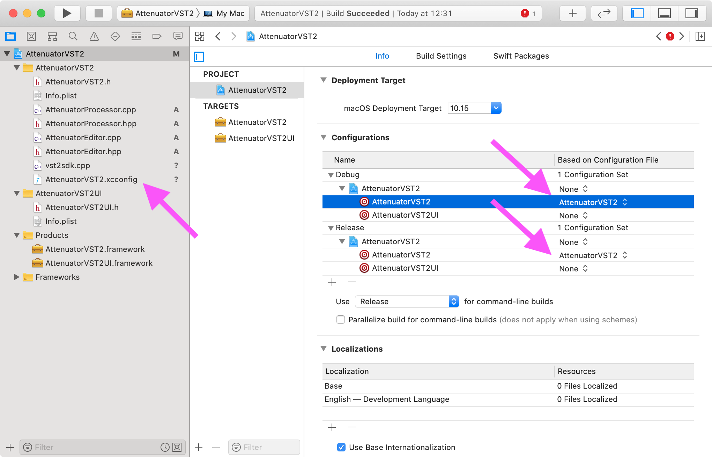

Attempt to build will lead to another error 📛 addressed compiler dialect.

```log
/Users/Shared/Developer/libs/Audio/vstsdk2.4rev2/public.sdk/source/vst2.x/audioeffect.cpp:512:20: error: non-constant-expression cannot be narrowed from type 'int' to 'char' in initializer list [-Wc++11-narrowing]
                        char temp[2] = {'0' + (char)digit, '\0'};
```

Well the VST SDK we are using was made in 2006. So, we need to downgrade compiler dialect to `gnu++98` to turn it to warning 😬.

```xcconfig
// AttenuatorVST2.xcconfig

HEADER_SEARCH_PATHS = $(VST2_SDK)/**
CLANG_CXX_LANGUAGE_STANDARD = gnu++98

// To suppress doc warnings
CLANG_WARN_DOCUMENTATION_COMMENTS = NO
```

Attempt to build will lead to another error 📛 addressed missed symbol. But this is expected since we not implemented required functions in plug-in processor yet. In order to fix we will implement simple **gain** plug-in. The functionality is the same as in `again` plug-in shipped with VST SDK in `$VST2_SDK/public.sdk/samples/vst2.x/again`.

```cpp
// AttenuatorProcessor.hpp

#ifndef AttenuatorProcessor_hpp
#define AttenuatorProcessor_hpp

#include "audioeffectx.h"

class AttenuatorProcessor : public AudioEffectX {
public:

   AttenuatorProcessor(audioMasterCallback audioMaster);
   virtual ~AttenuatorProcessor();

   // MARK: - Processing
   virtual void processReplacing(float **inputs, float **outputs, VstInt32 sampleFrames);
   virtual void processDoubleReplacing (double** inputs, double** outputs, VstInt32 sampleFrames);

   // MARK: - Programs
   virtual void setProgramName (char* name);
   virtual void getProgramName (char* name);

   // MARK: - Parameters
   virtual void setParameterAutomated (VstInt32 index, float value);
   virtual void setParameter (VstInt32 index, float value);
   virtual float getParameter (VstInt32 index);
   virtual void getParameterLabel (VstInt32 index, char* label);
   virtual void getParameterDisplay (VstInt32 index, char* text);
   virtual void getParameterName (VstInt32 index, char* text);

   // MARK: - Metadata
   virtual bool getEffectName (char* name);
   virtual bool getVendorString (char* text);
   virtual bool getProductString (char* text);

   virtual VstInt32 getVendorVersion () { return 1000; }
   virtual VstPlugCategory getPlugCategory () { return kPlugCategEffect; }

private:
   float mGain;
   char programName[kVstMaxProgNameLen + 1];
};

#endif /* AttenuatorProcessor_hpp */
```

```cpp
// AttenuatorProcessor.cpp

#include "AttenuatorProcessor.hpp"

AudioEffect* createEffectInstance(audioMasterCallback audioMaster) {
   return new AttenuatorProcessor(audioMaster);
}

AttenuatorProcessor::AttenuatorProcessor(audioMasterCallback audioMaster)
: AudioEffectX(audioMaster, 1, 1) { // 1 program and 1 parameter only.
   setNumInputs (2);       // stereo in
   setNumOutputs (2);      // stereo out
   setUniqueID ('MyAg');   // identify. Kind of unique ID of plug-in.
   canProcessReplacing (); // supports replacing output
   canDoubleReplacing ();  // supports double precision processing

   mGain = 1.f;           // default to 0 dB
   vst_strncpy(programName, "Default", kVstMaxProgNameLen);   // default program name
}

AttenuatorProcessor::~AttenuatorProcessor() {
   // Nothing to do at the moment.
}

// MARK: - Processing

void AttenuatorProcessor::processReplacing (float** inputs, float** outputs, VstInt32 sampleFrames) {

   float* in1  =  inputs[0];
   float* in2  =  inputs[1];
   float* out1 = outputs[0];
   float* out2 = outputs[1];

   while (--sampleFrames >= 0) {
      (*out1++) = (*in1++) * mGain;
      (*out2++) = (*in2++) * mGain;
   }
}

void AttenuatorProcessor::processDoubleReplacing (double** inputs, double** outputs, VstInt32 sampleFrames) {

   double* in1  =  inputs[0];
   double* in2  =  inputs[1];
   double* out1 = outputs[0];
   double* out2 = outputs[1];
   double dGain = mGain;

   while (--sampleFrames >= 0) {
      (*out1++) = (*in1++) * dGain;
      (*out2++) = (*in2++) * dGain;
   }
}

// MARK: - Programs

void AttenuatorProcessor::setProgramName (char* name) {
   vst_strncpy(programName, name, kVstMaxProgNameLen);
}

void AttenuatorProcessor::getProgramName (char* name) {
   vst_strncpy(name, programName, kVstMaxProgNameLen);
}

// MARK: - Parameters

void AttenuatorProcessor::setParameter (VstInt32 index, float value) {
   mGain = value;
}

void AttenuatorProcessor::setParameterAutomated (VstInt32 index, float value) {
   AudioEffectX::setParameterAutomated(index, value);
}

float AttenuatorProcessor::getParameter (VstInt32 index) {
   return mGain;
}

void AttenuatorProcessor::getParameterName (VstInt32 index, char* label) {
   vst_strncpy(label, "Gain", kVstMaxParamStrLen);
}

void AttenuatorProcessor::getParameterDisplay (VstInt32 index, char* text) {
   dB2string(mGain, text, kVstMaxParamStrLen);
}

void AttenuatorProcessor::getParameterLabel (VstInt32 index, char* label) {
   vst_strncpy(label, "dB", kVstMaxParamStrLen);
}

// MARK: - Metadata

bool AttenuatorProcessor::getEffectName (char* name) {
   vst_strncpy(name, "Attenuator VST2", kVstMaxEffectNameLen);
   return true;
}

bool AttenuatorProcessor::getProductString (char* text) {
   vst_strncpy(text, "Examples", kVstMaxProductStrLen);
   return true;
}

bool AttenuatorProcessor::getVendorString (char* text) {
   vst_strncpy(text, "Vlad Gorlov", kVstMaxVendorStrLen);
   return true;
}
```

Now we can build project. It will compiled and linked successfully.

Time to try using it in VST Host [Renoise](https://www.renoise.com/download). Before doing this we need to configure Xcode build scheme and update build settings to make it VST Host compatible.

First lets update build settings in file `AttenuatorVST2.xcconfig`.

```xcconfig
// AttenuatorVST2.xcconfig

HEADER_SEARCH_PATHS = $(VST2_SDK)/**
CLANG_CXX_LANGUAGE_STANDARD = gnu++98

// To suppress doc warnings
CLANG_WARN_DOCUMENTATION_COMMENTS = NO

// To make Plug-In VST Host compatible
DEPLOYMENT_LOCATION = YES
DSTROOT = $(HOME)/Library/Audio/Plug-Ins/VST/Development
INSTALL_PATH = /
SKIP_INSTALL = NO
GENERATE_PKGINFO_FILE = YES
WRAPPER_EXTENSION = vst
MACH_O_TYPE = mh_bundle

// Runtime settings
DYLIB_INSTALL_NAME_BASE = @rpath
LD_RUNPATH_SEARCH_PATHS = $(inherited) @executable_path/../Frameworks @loader_path/../Frameworks @loader_path/Frameworks
ALWAYS_EMBED_SWIFT_STANDARD_LIBRARIES = YES

// Other settings
CODE_SIGN_STYLE = Automatic
PRODUCT_NAME = $(TARGET_NAME:c99extidentifier)
DEFINES_MODULE = YES
INFOPLIST_FILE = AttenuatorVST2/Info.plist
PRODUCT_BUNDLE_IDENTIFIER = abc.example.AttenuatorVST2
COMBINE_HIDPI_IMAGES = YES
```

With the settings above the build product will be created directly in folder `$HOME/Library/Audio/Plug-Ins/VST` which is a special system location in which VST Host can find our plug-in.

Now we can go to **AttenuatorVST2** framework target and delete ❌ all build settings automatically made by Xcode.

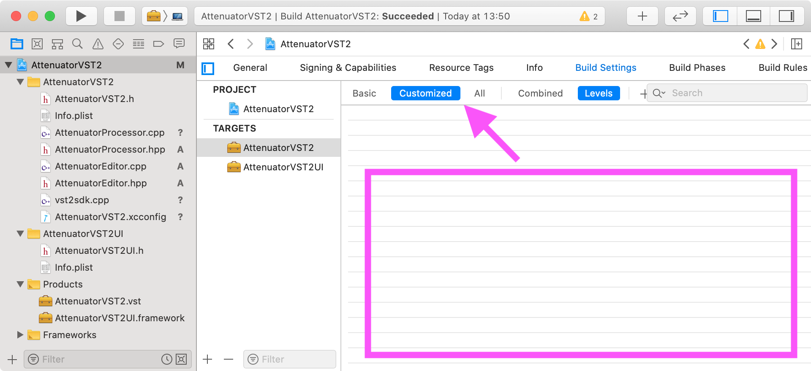

Also we need to change product type of **AttenuatorVST2** framework target from `com.apple.product-type.framework` to `com.apple.product-type.bundle`. This **can't** 😮 be changed within Xcode, so we need to manually edit file `AttenuatorVST2.xcodeproj/project.pbxproj` in text editor. After editing file please close and **reopen** Xcode project ‼️.

```diff
diff --git a/AttenuatorVST2.xcodeproj/project.pbxproj b/AttenuatorVST2.xcodeproj/project.pbxproj
index dc58c17606358ff83949c7427b85c29fed34b0c3..d40b71a6f404183f0891e0e478c4d5027832cc32 100644
--- a/AttenuatorVST2.xcodeproj/project.pbxproj
+++ b/AttenuatorVST2.xcodeproj/project.pbxproj
@@ -170,8 +170,8 @@
         );
         name = AttenuatorVST2;
         productName = AttenuatorVST2;
-        productReference = 808BBC7D2431F41F0053814A /* AttenuatorVST2.framework */;
-        productType = "com.apple.product-type.framework";
+        productReference = 808BBC7D2431F41F0053814A /* AttenuatorVST2.vst */;
+        productType = "com.apple.product-type.bundle";
      };
      808BBC8C2431F46A0053814A /* AttenuatorVST2UI */ = {
         isa = PBXNativeTarget;

```

After reopening Xcode project the icon of AttenuatorVST2 product will be changed to one which represents bundle.

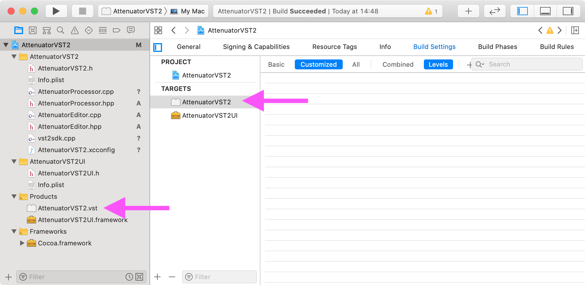

Before trying out plug-in in VST Host we need to update **Run** configuration of the **AttenuatorVST2** build schema in the way so that Xcode should ask us every time which application to launch.

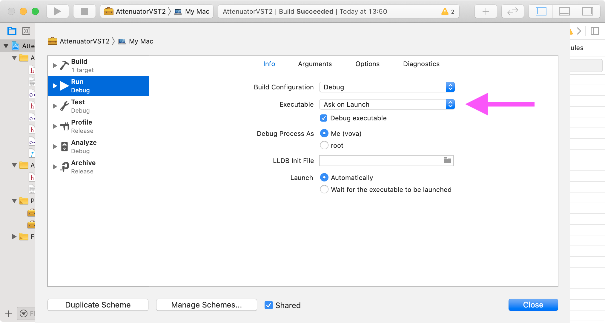

Finally we can run our plug-in in VST Host environment. We can also change **Gain** parameter to alter volume on **Master** bus in VST Host application.

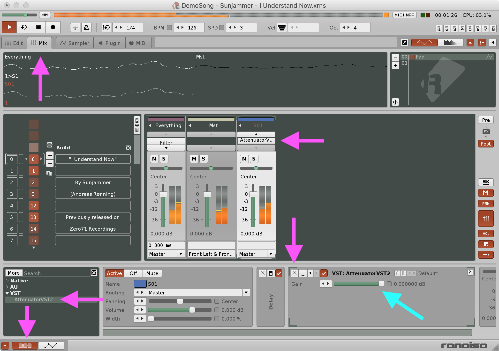

Summary of this step marked with git tag [Creating-Processing-part-of-Plug-In](https://github.com/vgorloff/mc-blog-swiftui-in-vst2/tags).

## Creating Editor part of Plug-In <a name="chapter-4"></a>

In Xcode 11.4 there still an issue when previewing SwiftUI made for macOS when UI files placed into separate framework. Attempt to preview raises an error 😮📛.

```log
 GenericHumanReadableError: unexpected error occurred

 messageRepliedWithError(
    "Connecting to launched interactive agent 11092",
    Optional(Error Domain=com.apple.dt.xcodepreviews.service Code=17 "connectToPreviewHost: Failed to connect to 11092: (null)" UserInfo={NSLocalizedDescription=connectToPreviewHost: Failed to connect to 11092: (null)})
)
```

But we still can use Playground to design SwiftUI for macOS. Once SwiftUI design is done, then we can add new file with name `MainUI.swift` and copy/paste contents from Playground.

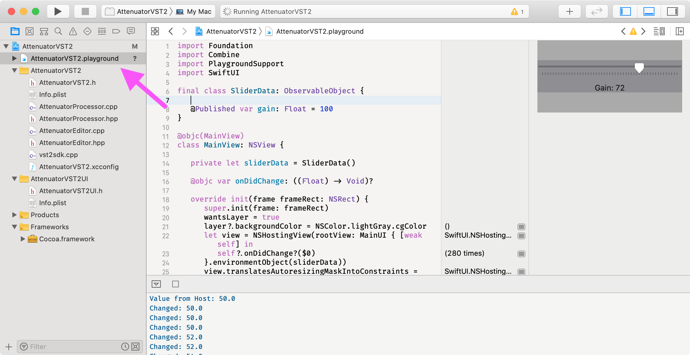

```swift
// MainUI.swift

import Foundation
import Combine
import SwiftUI

final class SliderData: ObservableObject {

   @Published var gain: Float = 100
}

@objc(MainView)
public class MainView: NSView {

   private let sliderData = SliderData()

   @objc public var onDidChange: ((Float) -> Void)?

   public override init(frame frameRect: NSRect) {
      super.init(frame: frameRect)
      wantsLayer = true
      layer?.backgroundColor = NSColor.lightGray.cgColor
      let view = NSHostingView(rootView: MainUI { [weak self] in
         let value = $0 / 100
         print("MainView> Value to Host: \(value)")
         self?.onDidChange?(value)
      }.environmentObject(sliderData))
      view.translatesAutoresizingMaskIntoConstraints = false
      addSubview(view)
      leadingAnchor.constraint(equalTo: view.leadingAnchor).isActive = true
      trailingAnchor.constraint(equalTo: view.trailingAnchor).isActive = true
      topAnchor.constraint(equalTo: view.topAnchor).isActive = true
      bottomAnchor.constraint(equalTo: view.bottomAnchor).isActive = true
   }

   public required dynamic init?(coder aDecoder: NSCoder) {
      fatalError()
   }

   @objc public func setGain(_ value: Float) {
      print("MainView> Value from Host: \(value)")
      sliderData.gain = 100 * value
   }
}

struct MainUI: View {

   @EnvironmentObject var sliderData: SliderData
   @State var gain: Float = 100

   private var onChanged: (Float) -> Void

   init(onChanged: @escaping (Float) -> Void) {
      self.onChanged = onChanged
   }

   var body: some View {
      VStack {
         Slider(value: Binding<Float>(get: { self.gain }, set: {
            self.gain = $0
            self.onChanged($0)
         }), in: 0...100, step: 2)
         Text("Gain: \(Int(gain))")
      }.onReceive(sliderData.$gain, perform: { self.gain = $0 })
   }
}
```

We can't expose SwiftUI view `MainUI` directly into Obj-C world. That's why we need to wrap it into `MainView` which can be used in VST Host environment. Here is how `MainView` exposed to Obj-C. It has method `setGain` and callback `onDidChange` which together allow to keep plug-in UI and VST Host in sync.

```objc
SWIFT_CLASS_NAMED("MainView")
@interface MainView : NSView
@property (nonatomic, copy) void (^ _Nullable onDidChange)(float);
- (nonnull instancetype)initWithFrame:(NSRect)frameRect OBJC_DESIGNATED_INITIALIZER;
- (nullable instancetype)initWithCoder:(NSCoder * _Nonnull)aDecoder OBJC_DESIGNATED_INITIALIZER;
- (void)setGain:(float)value;
@end
```

In order to use Obj-C from C++ we need to rename file `AttenuatorEditor.cpp` to `AttenuatorEditor.mm`. By doing this we informing Xcode that C++ class `AttenuatorEditor` in now type of Obj-C++ in which Obj-C and C++ can coexist together 🤝.

```cpp
// AttenuatorEditor.hpp

#ifndef AttenuatorEditor_hpp
#define AttenuatorEditor_hpp

#include "aeffeditor.h"

// Forward declarations.
#ifdef __OBJC__
@class MainView;
#else
typedef struct objc_object MainView;
#endif

class AttenuatorEditor : public AEffEditor
{
public:
   AttenuatorEditor (AudioEffect* ptr);
   virtual ~AttenuatorEditor();

   virtual bool open (void* ptr);
   virtual void close ();
   virtual bool getRect (ERect** rect);

   virtual void setParameter (VstInt32 index, float value);

private:

   ERect   rect;
   MainView* mView;
};

#endif /* AttenuatorEditor_hpp */
```

```objc
// AttenuatorEditor.mm

#include "AttenuatorEditor.hpp"
#import <Cocoa/Cocoa.h>
#import <AttenuatorVST2UI/AttenuatorVST2UI-Swift.h>

AttenuatorEditor::AttenuatorEditor(AudioEffect *effect) : AEffEditor (effect)  {
   mView = nil;
   effect->setEditor(this);
   this->rect.top = 0;
   this->rect.left = 0;
   this->rect.right = 200;
   this->rect.bottom = 100;
}

AttenuatorEditor::~AttenuatorEditor() {
   mView = nil;
}

bool AttenuatorEditor::open (void* ptr) {
   AEffEditor::open(ptr);

   NSView * parent = (__bridge NSView*)ptr;
   // Should be same dimensions as in `rect` property.
   NSRect proxyRect = NSMakeRect(0, 0, parent.bounds.size.width, parent.bounds.size.height);
   MainView * plugInView = [ [MainView alloc] initWithFrame: proxyRect];
   plugInView.translatesAutoresizingMaskIntoConstraints = true;
   plugInView.autoresizingMask = NSViewWidthSizable | NSViewHeightSizable;
   [parent addSubview: plugInView];
   [plugInView setNeedsDisplay:true];
   mView = plugInView;
   plugInView.onDidChange = ^(float gain) {
      effect->setParameterAutomated(0, gain); // We have only one parameter. Passing `0` as index.
   };
   [plugInView setGain: effect->getParameter(0)];
   return true;
}

void AttenuatorEditor::close() {
   [mView removeFromSuperview];
   mView = nil;
}

bool AttenuatorEditor::getRect(ERect** inRect) {
   *inRect = &rect;
   return true;
}

void AttenuatorEditor::setParameter(VstInt32 index, float value) {
   // Ignoring `index`. We have only one parameter.
   dispatch_async(dispatch_get_main_queue(), ^{
      [mView setGain: value];
   });
}
```

**In short**: Inside function call `bool AttenuatorEditor::open(void* ptr)` VST Host provides us pointer to `NSView *`. We are using that view to attach plug-in UI.

Attempt to build the project will raise various errors addressed build configuration 📛😬. The easiest way to fix is to create `AttenuatorVST2UI.xcconfig` file and remove build settings for `AttenuatorVST2UI` automatically created by Xcode.

```xcconfig

// AttenuatorVST2UI.xcconfig

INFOPLIST_FILE = AttenuatorVST2UI/Info.plist
PRODUCT_BUNDLE_IDENTIFIER = abc.example.AttenuatorVST2UI
PRODUCT_NAME = $(TARGET_NAME:c99extidentifier)
ALWAYS_EMBED_SWIFT_STANDARD_LIBRARIES = YES

CODE_SIGN_STYLE = Automatic
SWIFT_INSTALL_OBJC_HEADER = YES
DEFINES_MODULE = YES
SWIFT_VERSION = 5.0

COMBINE_HIDPI_IMAGES = YES
SKIP_INSTALL = YES
DYLIB_COMPATIBILITY_VERSION = 1
DYLIB_CURRENT_VERSION = 1
DYLIB_INSTALL_NAME_BASE = @rpath
LD_RUNPATH_SEARCH_PATHS = $(inherited) @executable_path/../Frameworks @loader_path/Frameworks
```

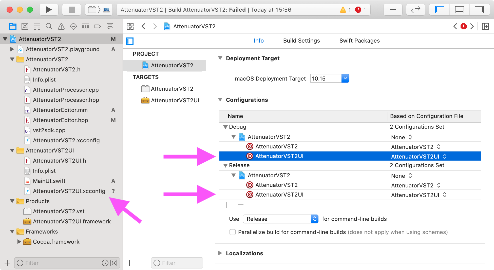

Now all build errors are gone. We can start consuming `AttenuatorEditor` in `AttenuatorProcessor` by implementing changes shown below.

```cpp
// AttenuatorProcessor.hpp

class AttenuatorProcessor : public AudioEffectX {
public:

   // Existing declarations skipped. They are not changed.

private:
   bool mIsUpdatingGain; // 1️⃣ Used to avoid parameter change loopback.
   float mGain;
   char programName[kVstMaxProgNameLen + 1];
};
```

```cpp
// AttenuatorProcessor.cpp

#include "AttenuatorProcessor.hpp"
#include "AttenuatorEditor.hpp" // 1️⃣ Imported new header.

AttenuatorProcessor::AttenuatorProcessor(audioMasterCallback audioMaster)
: AudioEffectX(audioMaster, 1, 1) { // 1 program and 1 parameter only.
   setNumInputs (2);       // stereo in
   setNumOutputs (2);      // stereo out
   setUniqueID ('MyAg');   // identify. Kind of unique ID of plug-in.
   canProcessReplacing (); // supports replacing output
   canDoubleReplacing ();  // supports double precision processing

   mGain = 1.f;           // default to 0 dB
   vst_strncpy(programName, "Default", kVstMaxProgNameLen);   // default program name

   this->setEditor (new AttenuatorEditor(this)); // 2️⃣ Using editor.
}

void AttenuatorProcessor::setParameterAutomated (VstInt32 index, float value) {
   mIsUpdatingGain = true; // 3️⃣ Needed to avoid loopback.
   AudioEffectX::setParameterAutomated(index, value);
   mIsUpdatingGain = false; // 3️⃣ Needed to avoid loopback.
}

void AttenuatorProcessor::setParameter (VstInt32 index, float value) {
   mGain = value;
   bool shouldUpdate = editor && editor->isOpen() && !mIsUpdatingGain;
   if(shouldUpdate) {
      ((AttenuatorEditor *)editor)->setParameter(index, value); // 4️⃣ Updating UI from VST Host.
   }
}
```

That's it 🙂. Now we can run our plug-in in VST Host environment. Now VST Host shows **Ext. Editor** button which means that our plugin has custom UI.

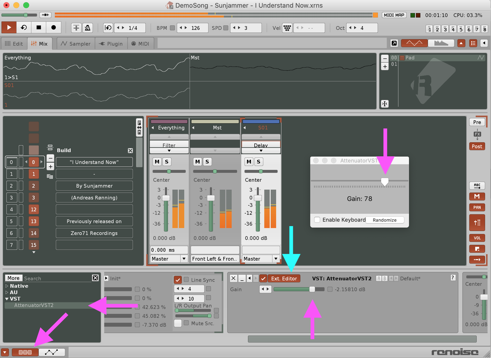

We can change **Gain** in VST Host or in Plug-In UI. Changes are in sync. In another VST Host, the **Reaper**, behavior is similar.

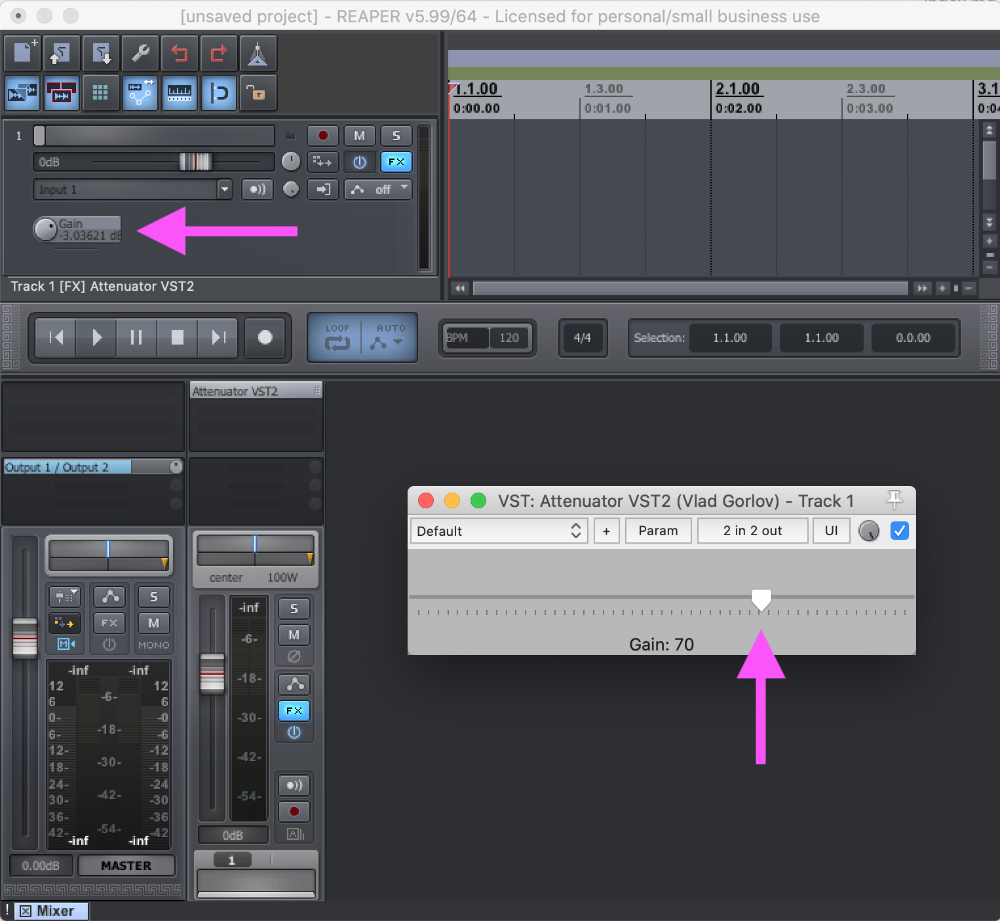

Summary of this step marked with git tag [Creating-Editor-part-of-Plug-In](https://github.com/vgorloff/mc-blog-swiftui-in-vst2/tags).

Good luck with SwiftUI and VST 👋!

Sources of Plug-In can be found at [GitHub](https://github.com/vgorloff/mc-blog-swiftui-in-vst2).
