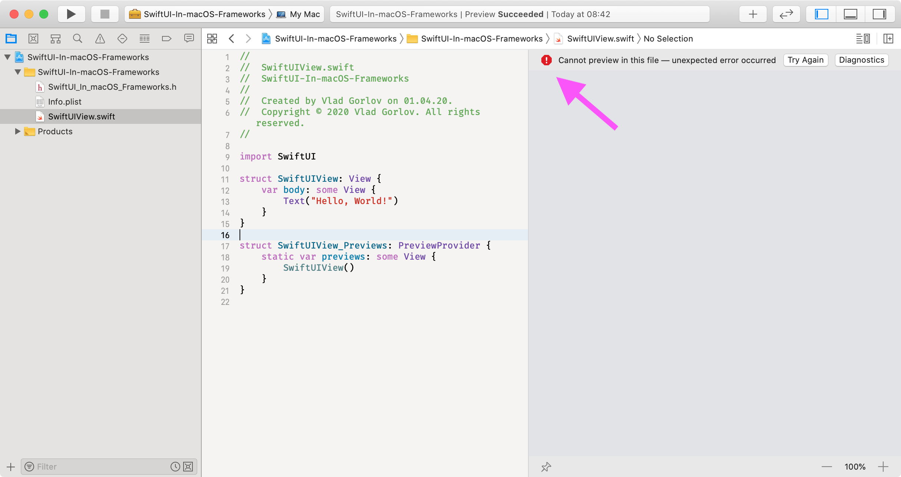
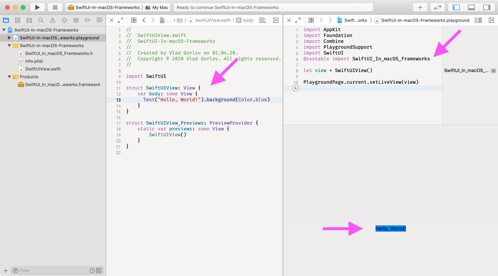
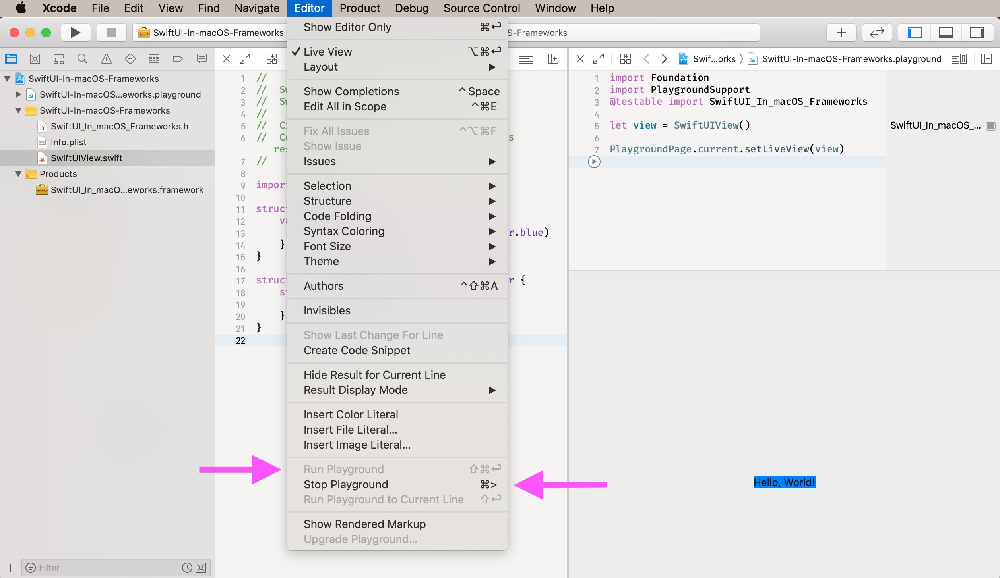

Say you have macOS **Framework** project without hosting macOS Application. And you also have SwiftUI view inside that framework. Attempt to use SwiftUI preview in Xcode 11.4 will fail with an error 📛.

```log
GenericHumanReadableError: unexpected error occurred

messageRepliedWithError(
   "Connecting to launched interactive agent 53762",
   Optional(Error Domain=com.apple.dt.xcodepreviews.service Code=17 "connectToPreviewHost: Failed to connect to 53762: (null)" UserInfo={NSLocalizedDescription=connectToPreviewHost: Failed to connect to 53762: (null)})
   )
```



Since we can use custom frameworks inside Xcode playgrounds, this means that we can also instantiate custom SwiftUI views inside playgrounds. Here is how playground code may look like.

```swift
import Foundation
import PlaygroundSupport
@testable import SwiftUI_In_macOS_Frameworks // 1️⃣ Importing custom Framework.

let view = SwiftUIView()

PlaygroundPage.current.setLiveView(view) // 2️⃣ Presenting custom SwiftUI as playground live view.
```



⚠️ **Downside**: We need to recompile framework target and restart Playground preview in order to see updates. But Xcode has a shortcuts to build framework target, start and stop Playground preview ✅. So, we can open SwiftUI view editor and Playground side by side and preview custom SwiftUI view in Playground.



Happy coding 👋!

Sources of the sample project can be found at [GitHub](https://github.com/vgorloff/mc-blog-swiftui-preview-in-playground).
