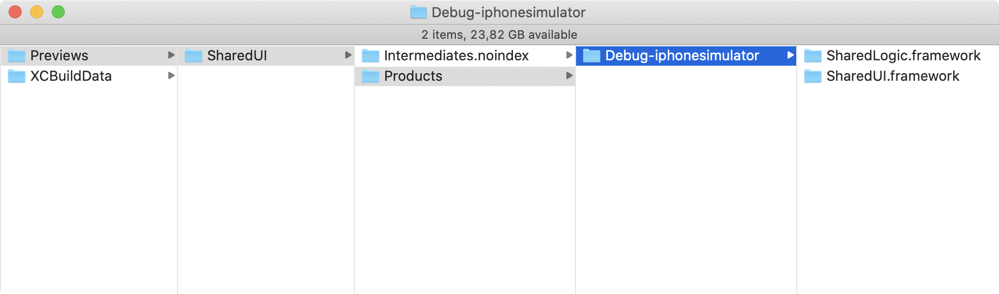

Say you have a modular [iOS application](https://github.com/vgorloff/mc-blog-swiftui-previews-in-modular-app-with-frameworks) which uses iOS frameworks for code separation. Say you also have a legacy UI made in `Xib` files or `Storyboards`, or views written in code. How to get all these types of UI working in SwiftUI previews in Xcode?

Let's make a sample application to experiment and to understand how Xib, Storyboards and views written in code can be used in SwiftUI previews.

The application consists with several frameworks:

- **SharedLogic**: Reusable non-UI code (DataSource, Enums, etc.)
- **SharedUI**: Reusable UI written from code (like reusable class `GradientView.swift`)
- **Settings**: Application-specific component which represents dummy App settings.
- **Dashboard**: Application-specific component which represents Main screen of App.
- **SwiftUI-Previews-in-Modular-app**: Application itself (AppDelegate, Main window, etc.).


Here is a dependencies between components:

- **SwiftUI-Previews-in-Modular-app** depends on **Dashboard**, **Settings**, **SharedUI** and **SharedLogic**.
- **Dashboard** depends on **Settings**, **SharedUI** and **SharedLogic**.
- **Settings** depends on **SharedUI** and **SharedLogic**.
- **SharedUI** depends only on **SharedLogic**.

### SharedUI

Lets start building preview for view `GradientView.swift` made from code. Here is how `GradientView` is looks like:

```swift
import Foundation
import UIKit

public class GradientView: UIView {

   private lazy var gradient = CAGradientLayer()

   public override init(frame: CGRect) {
      super.init(frame: frame)
      setupUI()
   }

   required init?(coder: NSCoder) {
      super.init(coder: coder)
      setupUI()
   }

   public override func layoutSubviews() {
      super.layoutSubviews()
      gradient.frame = bounds
   }
}

extension GradientView {

   private func setupUI() {
      let colors: [UIColor] = [.red, .orange, .yellow, .green, .cyan, .blue, .magenta]
      gradient.colors = colors.map { $0.cgColor }
      gradient.startPoint = CGPoint(x: 0, y: 0)
      gradient.endPoint = CGPoint(x: 1, y: 1)
      layer.insertSublayer(gradient, at: 0)
   }
}
```

In order to preview this class in SwiftUI we need another type `GradientView_UI` which conforms to `UIViewRepresentable`.

```swift
import Foundation

#if canImport(SwiftUI) && DEBUG
import SwiftUI

public struct GradientView_UI: UIViewRepresentable {

   let view = GradientView()

   public init() {
   }

   public func makeUIView(context: Context) -> GradientView {
      return view
   }

   public func updateUIView(_ uiView: GradientView, context: Context) {
   }
}

public struct GradientView_UI_Previews: PreviewProvider {

   static var views: [GradientView_UI] {
      let views = [
         GradientView_UI(),
         GradientView_UI()
      ]
      return views
   }

   public static var previews: some View {
      ZStack {
         Color.gray
         VStack {
            ForEach(views.indices) {
               views[$0].frame(minWidth: 0, maxWidth: 200, minHeight: 0, maxHeight: 200)
            }
         }
      }
      .previewDevice("iPhone SE")
   }
}
#endif
```

Attempt to preview `GradientView` fails due missed **SharedLogic** framework.


But **SharedLogic** framework was built and it exists in `DerivedData` directory under `/Build/Intermediates.noindex/Previews/SharedUI/Products/Debug-iphonesimulator/SharedLogic.framework`



Build log also shows that both frameworks **SharedUI** and **SharedLogic** were built successfully.


The **Library not loaded** error seems because of not satisfiable, default, setting for run-time search path – [@rpath](https://en.wikipedia.org/wiki/Rpath).

To fix it we have to update Xcode build setting `LD_RUNPATH_SEARCH_PATHS` by adding additional search path `@loader_path/../`. With this we instructing runtime to search frameworks one level up relative to current framework.

```ini
// Before
LD_RUNPATH_SEARCH_PATHS = @executable_path/Frameworks @loader_path/Frameworks

// After
LD_RUNPATH_SEARCH_PATHS = @loader_path/../ @executable_path/Frameworks @loader_path/Frameworks
```

After applying changes to `@rpath`, the SwiftUI preview for `GradientView` start working.


### Settings

In **Settings** framework we have `SettingsCell` made as a `Xib`-file and `SettingsViewController` which is a subclass of `UITableViewController` made from code. `SettingsViewController` uses `SettingsCell`. `SettingsCell` uses `GradientView` from **SharedUI** framework.


To preview cell and controller we creating two types `SettingsCell_UI` and `SettingsViewController_UI`. These types conforms to `UIViewRepresentable` and `UIViewControllerRepresentable` protocols respectively.

```swift
import SharedUI
import Foundation

#if canImport(SwiftUI) && DEBUG
import SwiftUI

struct SettingsCell_UI: UIViewRepresentable {

   let nib = UINib(nibName: "SettingsCell", bundle: Bundle(for: SettingsCell.self))
   func makeUIView(context: Context) -> SettingsCell {
      let cell = nib.instantiate(withOwner: nil, options: [:]).compactMap { $0 as? SettingsCell }.first
      cell?.setting = "Lorem ipsum"
      cell?.gradientAlpha = 0.5
      return cell!
   }

   func updateUIView(_ uiView: SettingsCell, context: Context) {

   }
}

public struct SettingsCell_UI_Previews: PreviewProvider {

   static var views: [SettingsCell_UI] {
      let views = [
         SettingsCell_UI(),
         SettingsCell_UI()
      ]
      return views
   }

   public static var previews: some View {
      ZStack {
         Color.gray
         VStack {
            ForEach(views.indices) {
               views[$0].frame(minWidth: 0, maxWidth: 200, minHeight: 0, maxHeight: 240)
            }
         }
      }
      .previewDevice("iPhone SE")
   }
}
#endif
```


```swift
import Foundation

#if canImport(SwiftUI) && DEBUG
import SwiftUI

public struct SettingsViewController_UI: UIViewControllerRepresentable {

   let vc = SettingsViewController()
   let nc = UINavigationController()

   public init() {}

   public func makeUIViewController(context: Context) -> UINavigationController {
      nc.setViewControllers([vc], animated: false)
      return nc
   }

   public func updateUIViewController(_ uiViewController: UINavigationController, context: Context) {
   }
}

public struct SettingsViewController_UI_Previews: PreviewProvider {
    public static var previews: some View {
        SettingsViewController_UI().previewDevice("iPhone SE")
    }
}
#endif
```


### Dashboard

**Dashboard** framework contains two view controllers made as a `Storyboard`-file. One of controllers uses a `UITableViewCell` also configured in same `Storyboard`-file.


As before for previewing view controllers we creating additional types which conformed to `UIViewControllerRepresentable` protocol.

Type `DashboardViewController_UI`:

```swift
import Foundation

#if canImport(SwiftUI) && DEBUG
import SwiftUI

public struct DashboardViewController_UI: UIViewControllerRepresentable {

   let bundle = Bundle(for: DashboardViewController.self)

   public init() {}

   public func makeUIViewController(context: Context) -> DashboardViewController {
      let vc = UIStoryboard(name: "Dashboard", bundle: bundle).instantiateInitialViewController() as! DashboardViewController
      return vc
   }

   public func updateUIViewController(_ uiViewController: DashboardViewController, context: Context) {
   }
}

public struct DashboardViewController_UI_Previews: PreviewProvider {
   public static var previews: some View {
      DashboardViewController_UI().previewDevice("iPhone SE")
   }
}
#endif
```


Type `AphorismsViewController_UI`:

```swift
import Foundation

#if canImport(SwiftUI) && DEBUG
import SwiftUI

struct AphorismsViewController_UI: UIViewControllerRepresentable {

   let bundle = Bundle(for: AphorismsViewController.self)
   let nc = UINavigationController()

   func makeUIViewController(context: Context) -> UINavigationController {
      let vc = UIStoryboard(name: "Dashboard", bundle: bundle).instantiateViewController(identifier: "Aphorisms") as! AphorismsViewController
      nc.setViewControllers([vc], animated: false)
      return nc
   }

   func updateUIViewController(_ uiViewController: UINavigationController, context: Context) {
   }
}

public struct AphorismsViewController_UI_Previews: PreviewProvider {
   public static var previews: some View {
      AphorismsViewController_UI().previewDevice("iPhone SE")
   }
}

#endif
```


We can also switch to **SwiftUI-Previews-in-Modular-app** scheme and preview several controllers or views, used in App, at once.

```swift
import Foundation
import SharedUI
import Dashboard
import Settings

#if canImport(SwiftUI) && DEBUG
import SwiftUI

struct Application_UI_Previews: PreviewProvider {
   static var previews: some View {
      Group {
         GradientView_UI().previewDevice("iPhone SE");
         DashboardViewController_UI().previewDevice("iPhone SE");
         SettingsViewController_UI().previewDevice("iPhone SE")
      }
   }
}
#endif
```


**Live Preview** and **Debug Preview** also works!


The modular [iOS application](https://github.com/vgorloff/mc-blog-swiftui-previews-in-modular-app-with-frameworks), which uses several frameworks, works with SwiftUI previews. Only small fix addressed run-time search path, `@rpath`, was needed.

Happy modular coding!
