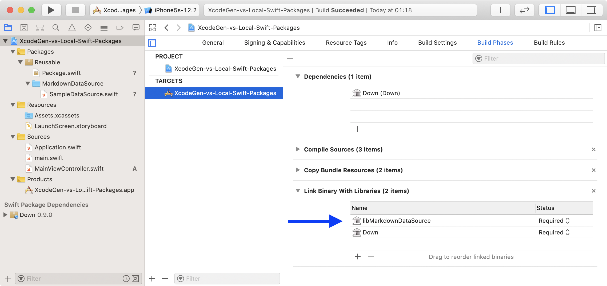

[XcodeGen](https://github.com/yonaskolb/XcodeGen) is a command line tool written in Swift that generates your Xcode project using your folder structure and a project spec. Since version [2.8.0](https://github.com/yonaskolb/XcodeGen/releases/tag/2.8.0) it supports Swift Package dependencies. It supports remote and local Swift Packages in same way as explained in WWDC 2019 Session 410 and shown in a WWDC [demo](https://developer.apple.com/videos/play/wwdc2019-410/?time=1447). But what if we want to use local Swift Package without corresponding remote part?

## Revealing the problem

1. Make sure that you have XcodeGen installed.

   ```shell
   brew search xcodegen

   # Install if not exists
   brew install xcodegen
   ```

2. Checkout sample project which uses external and local Swift packages.

   ```shell
   git clone https://github.com/vgorloff/mc-blog-xcodegen-vs-local-swift-packages.git
   ```

3. Generate Xcode project.

   ```shell
   $ xcodegen
   Loaded project:
     Name: XcodeGen-vs-Local-Swift-Packages
     Targets:
       XcodeGen-vs-Local-Swift-Packages: iOS application
   ⚙️  Generating plists...
   ⚙️  Generating project...
   ⚙️  Writing project...
   Created project at ~/blog-xcodegen-vs-local-swift-packages/XcodeGen-vs-Local-Swift-Packages.xcodeproj
   ```

4. Open generated project in Xcode and run it on iOS Simulator or iOS Device.


**It works!** Now let's have a look what is inside.

Inside `project.yml` file we have reference to external Swift package `Down`. It is used to convert Markdown text into `NSAttributedString` which is displayed in `UITextView`. External Swift package specified as shown below:

```yml
packages:
  Down:
    url: https://github.com/iwasrobbed/Down.git
    version: 0.9.0

targets:
  XcodeGen-vs-Local-Swift-Packages:
    type: application
    platform: iOS
    dependencies:
      - package: Down
```

As you can see the iOS application `XcodeGen-vs-Local-Swift-Packages` refers to `Down` dependency. So that we can import and use `Down` in `MainViewController`.


Say, we want to keep reusable Sources as a static Swift library. But we don't want to introduce dedicated Git repository for it. For example we can create Swift package under `Reusable` folder.

```none
├── Info.plist
├── Resources
│   ├── Assets.xcassets
│   └── LaunchScreen.storyboard
├── Reusable
│   ├── MarkdownDataSource
│   │   └── SampleDataSource.swift
│   └── Package.swift
├── Sources
│   ├── Application.swift
│   ├── MainViewController.swift
│   └── main.swift
├── XcodeGen-vs-Local-Swift-Packages.xcodeproj
└── project.yml
```

Once created, the `Reusable` folder can be opened in Xcode 11 as a local Swift package (Menu → File → Open...). Now we can Edit and Build it separately from rest of application.


Now we can configure local package in `project.yml`.

```yml
packages:
  Down:
    url: https://github.com/iwasrobbed/Down.git
    version: 0.9.0

localPackages:
  - ./Reusable
```

As result our local package will be shown in Xcode.


But it is still not linked to iOS application. Attempt to add it as a dependency will fail with error. XcodeGen not allowing us to link to the local package.

```yml
targets:
  XcodeGen-vs-Local-Swift-Packages:
    type: application
    platform: iOS
    sources:
      - Sources
      - Resources
    dependencies:
      - package: Down
      - package: Reusable
```

```shell
$ xcodegen
Loaded project:
  Name: XcodeGen-vs-Local-Swift-Packages
  Targets:
    XcodeGen-vs-Local-Swift-Packages: iOS application
Spec validation error: Target "XcodeGen-vs-Local-Swift-Packages" has an invalid package dependency "Reusable"
```

We can link to local Swift package manually, but after next regeneration, the Xcode project will be recreated and our changes will be lost.


When manually adding dependency, we introducing the changes in file `XcodeGen-vs-Local-Swift-Packages.xcodeproj/project.pbxproj`.

<!-- markdownlint-disable MD010 -->

```diff
--- /project.pbxproj	2019-10-24 23:35:21.000000000 +0200
+++ /project.pbxproj	2019-10-24 23:35:48.000000000 +0200
@@ -3,13 +3,14 @@
 	archiveVersion = 1;
 	classes = {
 	};
-	objectVersion = 51;
+	objectVersion = 52;
 	objects = {

 /* Begin PBXBuildFile section */
 		4B8A80B305DB749E58E409F6 /* Application.swift in Sources */ = {isa = PBXBuildFile; fileRef = A971C7613E6E665D4F6FF57D /* Application.swift */; };
 		4D52DE8B9DD634621E574B8E /* MainViewController.swift in Sources */ = {isa = PBXBuildFile; fileRef = FB3C76C99BEC7CD0AC3A81EA /* MainViewController.swift */; };
 		5CABB1ADB34570625B773853 /* Down in Frameworks */ = {isa = PBXBuildFile; productRef = DCD9E5EF91F372F27613A068 /* Down */; };
+		8047BAD2236250B4002C7A30 /* libMarkdownDataSource in Frameworks */ = {isa = PBXBuildFile; productRef = 8047BAD1236250B4002C7A30 /* libMarkdownDataSource */; };
 		B6373FA3215468CB97C781C3 /* LaunchScreen.storyboard in Resources */ = {isa = PBXBuildFile; fileRef = 0F1B834BAEFB6B1C11AC10D4 /* LaunchScreen.storyboard */; };
 		BA31C4DC39C24C3E99D39BED /* main.swift in Sources */ = {isa = PBXBuildFile; fileRef = DBC78F1A31D10158109C39C3 /* main.swift */; };
 		FEAF15B0A39916C68FC4F5E3 /* Assets.xcassets in Resources */ = {isa = PBXBuildFile; fileRef = C32764F595E6FF8C397ED905 /* Assets.xcassets */; };
@@ -17,7 +18,7 @@

 /* Begin PBXFileReference section */
 		0F1B834BAEFB6B1C11AC10D4 /* LaunchScreen.storyboard */ = {isa = PBXFileReference; lastKnownFileType = file.storyboard; path = LaunchScreen.storyboard; sourceTree = "<group>"; };
-		5179971AE6D53811330675B9 /* Reusable */ = {isa = PBXFileReference; lastKnownFileType = folder; name = Reusable; path = Reusable; sourceTree = SOURCE_ROOT; };
+		5179971AE6D53811330675B9 /* Reusable */ = {isa = PBXFileReference; lastKnownFileType = folder; path = Reusable; sourceTree = SOURCE_ROOT; };
 		6CBC6884D926F6F98A4BAE7F /* XcodeGen-vs-Local-Swift-Packages.app */ = {isa = PBXFileReference; includeInIndex = 0; lastKnownFileType = wrapper.application; path = "XcodeGen-vs-Local-Swift-Packages.app"; sourceTree = BUILT_PRODUCTS_DIR; };
 		A971C7613E6E665D4F6FF57D /* Application.swift */ = {isa = PBXFileReference; lastKnownFileType = sourcecode.swift; path = Application.swift; sourceTree = "<group>"; };
 		C32764F595E6FF8C397ED905 /* Assets.xcassets */ = {isa = PBXFileReference; lastKnownFileType = folder.assetcatalog; path = Assets.xcassets; sourceTree = "<group>"; };
@@ -30,6 +31,7 @@
 			isa = PBXFrameworksBuildPhase;
 			buildActionMask = 2147483647;
 			files = (
+				8047BAD2236250B4002C7A30 /* libMarkdownDataSource in Frameworks */,
 				5CABB1ADB34570625B773853 /* Down in Frameworks */,
 			);
 			runOnlyForDeploymentPostprocessing = 0;
@@ -53,6 +55,13 @@
 			name = Packages;
 			sourceTree = SOURCE_ROOT;
 		};
+		8047BAD0236250B4002C7A30 /* Frameworks */ = {
+			isa = PBXGroup;
+			children = (
+			);
+			name = Frameworks;
+			sourceTree = "<group>";
+		};
 		89700A6B75DEADB3B36AF1C4 /* Resources */ = {
 			isa = PBXGroup;
 			children = (
@@ -69,6 +78,7 @@
 				89700A6B75DEADB3B36AF1C4 /* Resources */,
 				D60DD396B1B59F975BA13A40 /* Sources */,
 				435FA52CBFFC103F61B1F850 /* Products */,
+				8047BAD0236250B4002C7A30 /* Frameworks */,
 			);
 			indentWidth = 3;
 			sourceTree = "<group>";
@@ -99,11 +109,13 @@
 			buildRules = (
 			);
 			dependencies = (
+				8047BACF236250B1002C7A30 /* PBXTargetDependency */,
 				0F43F1524178D14C8A17896B /* PBXTargetDependency */,
 			);
 			name = "XcodeGen-vs-Local-Swift-Packages";
 			packageProductDependencies = (
 				DCD9E5EF91F372F27613A068 /* Down */,
+				8047BAD1236250B4002C7A30 /* libMarkdownDataSource */,
 			);
 			productName = "XcodeGen-vs-Local-Swift-Packages";
 			productReference = 6CBC6884D926F6F98A4BAE7F /* XcodeGen-vs-Local-Swift-Packages.app */;
@@ -167,6 +179,10 @@
 			isa = PBXTargetDependency;
 			productRef = DCD9E5EF91F372F27613A068 /* Down */;
 		};
+		8047BACF236250B1002C7A30 /* PBXTargetDependency */ = {
+			isa = PBXTargetDependency;
+			productRef = 8047BACE236250B1002C7A30 /* libMarkdownDataSource */;
+		};
 /* End PBXTargetDependency section */

 /* Begin XCBuildConfiguration section */
@@ -349,6 +365,14 @@
 /* End XCRemoteSwiftPackageReference section */

 /* Begin XCSwiftPackageProductDependency section */
+		8047BACE236250B1002C7A30 /* libMarkdownDataSource */ = {
+			isa = XCSwiftPackageProductDependency;
+			productName = libMarkdownDataSource;
+		};
+		8047BAD1236250B4002C7A30 /* libMarkdownDataSource */ = {
+			isa = XCSwiftPackageProductDependency;
+			productName = libMarkdownDataSource;
+		};
 		DCD9E5EF91F372F27613A068 /* Down */ = {
 			isa = XCSwiftPackageProductDependency;
 			package = 55FB497A1477990488BE26F7 /* XCRemoteSwiftPackageReference "Down" */;
```

<!-- markdownlint-enable MD010 -->

That's pretty a lot but looks like we just need to establish few dependencies to make the iOS application linkable. In order to establish dependency between local Swift package and iOS application we can use [XcodeProj](https://github.com/tuist/xcodeproj) library. It is a Swift library for parsing and working with Xcode projects.

To automate post-generation changes we will use [swift-sh](https://github.com/mxcl/swift-sh) tool. This tool allows easily script with third-party Swift dependencies.

```shell
brew install mxcl/made/swift-sh
```

The possible implementation of dependency fix script can be as shown below:

```swift
#!/usr/bin/swift sh

// File: post-generate.swift

import Foundation
import XcodeProj // @tuist == 7.1.0
import PathKit

guard CommandLine.arguments.count == 2 else {
   let arg0 = Path(CommandLine.arguments[0]).lastComponent
   fputs("usage: \(arg0) <project>\n", stderr)
   exit(1)
}

let productNames = ["libMarkdownDataSource"] // Keep it up to date with library names.

let projectPath = Path(CommandLine.arguments[1])
let xcodeproj = try XcodeProj(path: projectPath) // Opening project.

// Preparing dependencies in Batch mode.
let packageDependencies = productNames.map { XCSwiftPackageProductDependency(productName: $0) }
packageDependencies.forEach { xcodeproj.pbxproj.add(object: $0) }

// Adding dependencies in Batch mode.
xcodeproj.pbxproj.nativeTargets.forEach {
   print("→ Adding dependencies to `\($0.name)`")
   $0.packageProductDependencies += packageDependencies
}

try xcodeproj.write(path: projectPath) // Saving project.
```

After running `XcodeGen` and `post-generate.swift` we can use local packages in Xcode 11!

```shell
# Making our script to be executable.
chmod u+x ./post-generate.swift
```

```shell
# Generate project with XcodeGen and post-generate.swift fix.
xcodegen && ./post-generate.swift ./XcodeGen-vs-Local-Swift-Packages.xcodeproj
```



Now iOS application linked to local Swift package. We can compile and run application. And **It works**!

And we reached "our" goal – use XcodeGen with Local Swift packages!
